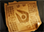
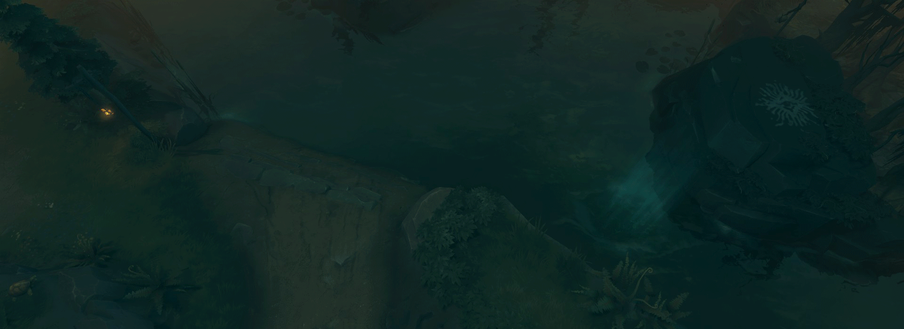

# 10. Предметы

## Предметы

Предметы, которые должен покупать конкретный герой, обычно разделяют на следующие категории:

* Начальные предметы (Starting Items) - покупаются в начале матча.
* Основные предметы (Core Items) - предметы, которые герой покупает в большинстве матчей.
* Ситуативные предметы (Situational Items) - покупаются в зависимости от обстоятельств. Для нейтрализации конкретных героев вражеской команды и их предметов.
* Люксовые предметы (Luxury Items) - покупаются, как правило, в длинных матчах, когда герой хорошо справляется с фармом.

В меню лавки есть список предметов, рекомендуемых для вашего героя. Этот список разбит на рассмотренные выше четыре категории. Обычно, предметы следуют в том порядке, в котором их следует покупать. Например, основные предметы идут перед люксовыми.

Предметы определяются несколькими характеристиками:

* **Расходуемые** (Consumable) или **Нерасходуемые** (Non-consumable).
Расходуемые предметы используются только ограничиннное число раз. Цель использования некоторых из таких предметов - одно существо, например Healing Salves и Mana Potions, которые восстанавливают здоровье и ману. Другие предметы предназначены для размещения на карте, например Observer Ward и Sentry Wards. Третий вид предметов воздействует на область, например Dust of Appearance (обнаруживает невидимых существи) и Smoke of Deceit (делает союзных героев невидимыми).

* **Активные** (Active) или **Пассивные** (Passive).
Как и способности героев, предметы могут быть активными и пассивными. Свойства активных предметов используются так же, как активные способности героя. Свойства пассивных предметов воздействуют постоянно. Более подробно о способностях героев написано в разделе ["7. Способности"](7_abilities.md).

* **Бонусы параметров** (Stat Bonuses).

Почти все предметы улучшают некоторые свойства героя: силу, ловкость, интеллект, урон, броню, скорость передвижения, регенерацию здоровья и т.д.

* **Базовые, улучшаемые предметы и рецепты**.
    * Базовые предметы (Basic Items) - продаются на вкладке лавки "Основные". Они не собираются из других предметов.
    * Улучшаемые предметы (Upgrade Items) - собираются из других базовых, улучшаемых предметов и рецептов. Эти предметы доступны на вкладке лавки "Улучшения". Чтобы получить такой предмет, вам необходимо купить его составные части и поместить их в инвентарь героя. Сборка происходит автоматически.
    * [**Рецепты**](https://dota2-ru.gamepedia.com/%D0%A0%D0%B5%D1%86%D0%B5%D0%BF%D1%82%D1%8B) - составная часть некоторых улучшаемых предметов. Сами по себе рецпты не дают никакого эффекта. Единственное их применение - это сборка улучшаемого предмета.

## Важные предметы

Есть ряд важных базовых предметов, которые часто используются в каждой игре.

* [**Town Portal Scroll**](https://dota2-ru.gamepedia.com/Town_Portal_Scroll) (TP) (100 золота) - расходуемый предмет, который телепортирует героя к любому союзному строению на карте. Этот дешевый предмет вы должны покупать всегда. С его помощью можно покинуть опасную зону, защитить союзную башню или просто вернуться к фонтану, чтобы восстановить здоровье.
*  [**Observer Ward**](https://dota2-ru.gamepedia.com/Observer_Ward) (80 золота) - расходуемый предмет, который размещается на карте и даёт обзор области вокруг себя.
    * Днём и ночью радиус обзора одинаковый - 1600 единиц.
    * Необходим для контроля карты и отслеживания вражеских героев.
    * Всегда старайтесь размещать как можно больше этих предметов на карте.
    * Через 7 минут после размещения предмет исчезает.
*  [**Sentry Ward**](https://dota2-ru.gamepedia.com/Sentry_Ward) (100 золота) - расходуемый предмет похожий на Observer Ward.
    * При установке дают небольшую область обзора и обнаруживают невидимых существ в этой области.
    * Днём и ночью радиус обзора одинаковый - 150 единиц.
    * Радиус обнаружения невидимых существ больше, чем радиус обзора.
    * Радиус обнаружения 850 единиц.
    * Через 4 минуты после размещения предмет исчезает.

Результат размещения Observer Ward и Sentry Ward:

*  [**Healing Salve**](https://dota2-ru.gamepedia.com/Healing_Salve) (110 золота) - расходуемый предмет, который значительнео ускоряет регенерацию здоровья на короткий промежуток времени. Эффект от это предмета прекращается, как только герой получает урон.
