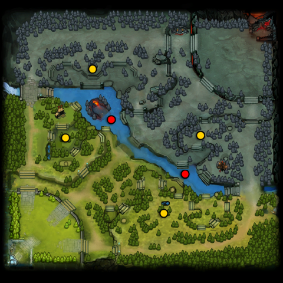
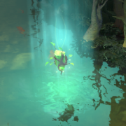
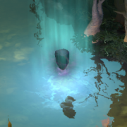
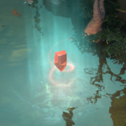
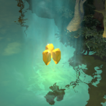
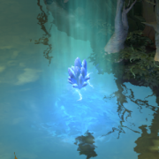
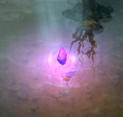
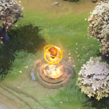
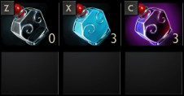

# 11. Руны

## Руны

[**Руны**](https://dota2-ru.gamepedia.com/%D0%A0%D1%83%D0%BD%D1%8B) (Runes) - это особые предметы, которые появляются в шести местах на карте. Любой герой может подобрать руну. После этого она используется и оказывает своё воздействие на героя.

Руны делятся на две категории. **Руны богатства** (Bounty Runes) дают подобравшему герою золото и опыт. **Усиливающие руны** (Power-up Runes) дают особый бафф на короткий период времени.

* Руны богатства появляются на отметке 0:00 игрового таймера, и через каждые две минуты после.
* Усиливающие руны появляются в 2:00 на игровом таймере, и через каждые две минуты после.
* Руны богатства появляются в четырёх местах на карте: две на стороне Сил Света, и две на стороне Сил Тьмы.
* Случайные усиливающие руны появляются в двух местах на реке.

Места появления рун (жёлтые круги - руны богатства, красные - усиливающие руны):

Типы рун:

* [**Регенерация**](https://dota2-ru.gamepedia.com/%D0%A0%D1%83%D0%BD%D1%8B#.D0.A0.D0.B5.D0.B3.D0.B5.D0.BD.D0.B5.D1.80.D0.B0.D1.86.D0.B8.D1.8F) (Regeneration) - в течении 30 секунд быстро восстанавливает здоровье и ману героя. Эффект пропадает, как только герой получает урон или полностью восстанавливает своё здоровье и ману.

Руна регенерации:

* [**Невидимость**](https://dota2-ru.gamepedia.com/%D0%A0%D1%83%D0%BD%D1%8B#.D0.9D.D0.B5.D0.B2.D0.B8.D0.B4.D0.B8.D0.BC.D0.BE.D1.81.D1.82.D1.8C) (Invisibility) - делает героя невидимым на 45 секунд. При активации эффект от руны начнётся через 1 секунду. Эта задержка известна, как "время угасания" ("fade time"). Невидимость прекращается, если герой атакует, использует предмет или способность.

Руна невидимости:

* [**Ускорение**](https://dota2-ru.gamepedia.com/%D0%A0%D1%83%D0%BD%D1%8B#.D0.A3.D1.81.D0.BA.D0.BE.D1.80.D0.B5.D0.BD.D0.B8.D0.B5) (Haste) - на 30 секунд даёт герою максимальную скорость передвижения.

Руна ускорения:

* [**Иллюзии**](https://dota2-ru.gamepedia.com/%D0%A0%D1%83%D0%BD%D1%8B#.D0.98.D0.BB.D0.BB.D1.8E.D0.B7.D0.B8.D0.B8) (Illusion) - на 75 секунд создаёт две [иллюзии](https://dota2-ru.gamepedia.com/%D0%98%D0%BB%D0%BB%D1%8E%D0%B7%D0%B8%D0%B8) героя, использовавшего руну.

Руна иллюзий:

* [**Двойной урон**](https://dota2-ru.gamepedia.com/%D0%A0%D1%83%D0%BD%D1%8B#.D0.94.D0.B2.D0.BE.D0.B9.D0.BD.D0.BE.D0.B9_.D1.83.D1.80.D0.BE.D0.BD) (Double Damage) - на 45 секунд даёт герою и его иллюзиям +100% урона. Эффект распространяется только на базовый урон (base damage) героя и урон от параметров. Чистый бонус к урону, который дают некоторые предметы, не учитывается.

Руна двойного урона:

* [**Волшебство**](https://dota2-ru.gamepedia.com/%D0%A0%D1%83%D0%BD%D1%8B#.D0.92.D0.BE.D0.BB.D1.88.D0.B5.D0.B1.D1.81.D1.82.D0.B2.D0.BE) (Arcane) - в течении 50 секунд уменьшает на 30% время перезарядки и на 40% затраты маны при использовании способностей героя и предметов.

Руна волшебства:

* [**Богатство**](https://dota2-ru.gamepedia.com/%D0%A0%D1%83%D0%BD%D1%8B#.D0.A0.D1.83.D0.BD.D0.B0_.D0.B1.D0.BE.D0.B3.D0.B0.D1.82.D1.81.D1.82.D0.B2.D0.B0) - даёт герою опыт и золото. В течении матча бонус от использования руны увеличивается.

Руна богатства:

## Хранение рун

Подобрав руну, её можно не только сразу же использовать, но и хранить в предмете [**bottle**](https://dota2-ru.gamepedia.com/Bottle) (бутылка).

* Bottle - при активации восстанавливает здоровье и ману в течении трёх секунд. Предмет можно использовать три раза, после чего его нужно зарядить у фонтана. Для этого достаточно подойти к фонтану, имея в инвентаре (но не в рюкзаке) героя bottle. Курьер может зарядить этот предмет вместо вас.

Если вы подбираете руну и имеете в инвентаре bottle, руна помещается в этот предмет. После этого руну можно использовать в любой момент, через активацию bottle. Обычный эффект восстановления от bottle станет доступен только после использования хранящейся в ней руны.

Иконки bottle в инвентаре: пустая, полная и с руной невидимости внутри.

После использования руны, хранящейся в bottle, предмет будет перезаряжен. Поэтому, для получения максимального эффекта, используйте bottle полностью перед помещением в неё руны.

Руна может находиться в bottle только до момента возникновения следующей руны. Тогда она используется автоматически.
