# 12. Лавка

## Типы и расположение

* [**Основная лавка**](https://dota2-ru.gamepedia.com/%D0%9E%D1%81%D0%BD%D0%BE%D0%B2%D0%BD%D0%B0%D1%8F_%D0%BB%D0%B0%D0%B2%D0%BA%D0%B0) (Base Shop) расположена около фонтана каждой команды. Большинство предметов можно купить в ней.

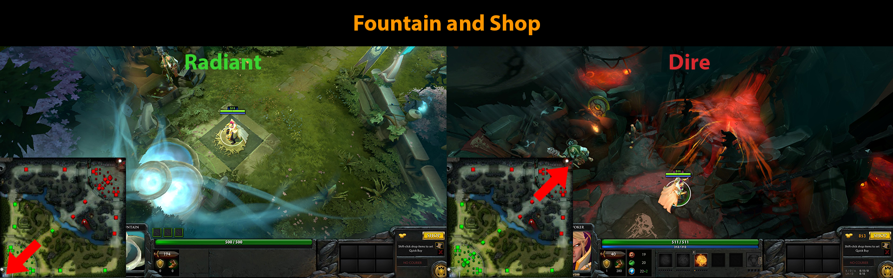

* [**Потайная лавка**](https://dota2-ru.gamepedia.com/%D0%9F%D0%BE%D1%82%D0%B0%D0%B9%D0%BD%D0%B0%D1%8F_%D0%BB%D0%B0%D0%B2%D0%BA%D0%B0) (Secret Shop)
    * Предлагает самые дорогие предметы в игре, большинство из которых не доступно в других лавках.
    * Предметы из потайной лавки, как правило, являются составными частями более мощных предметов.

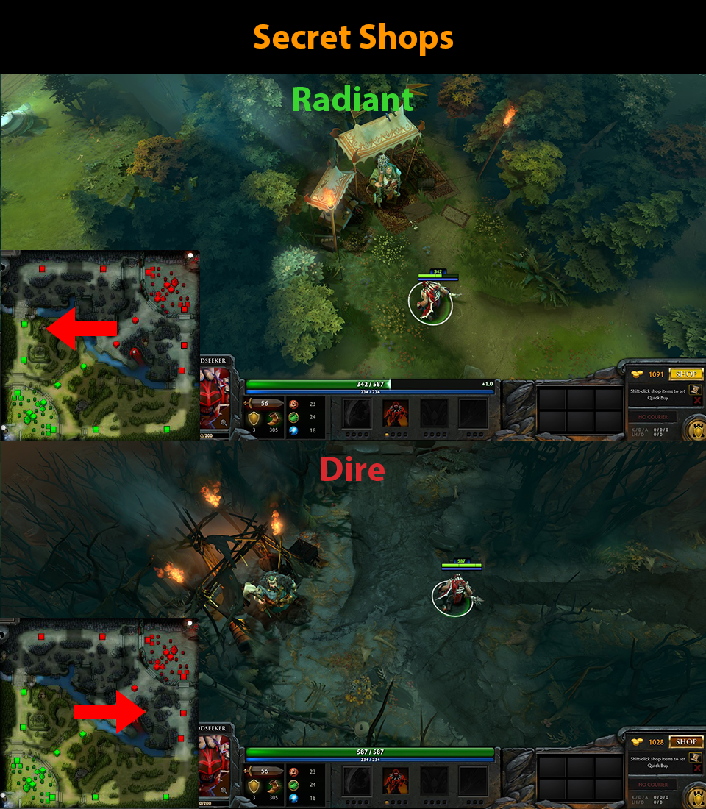

* [**Боковая лавка**](https://dota2-ru.gamepedia.com/%D0%91%D0%BE%D0%BA%D0%BE%D0%B2%D1%8B%D0%B5_%D0%BB%D0%B0%D0%B2%D0%BA%D0%B8) (Side Lane Shop) - предлагают меньший ассортимент товаров, чем основная лавка. Расположены на верхней и нижней линиях.

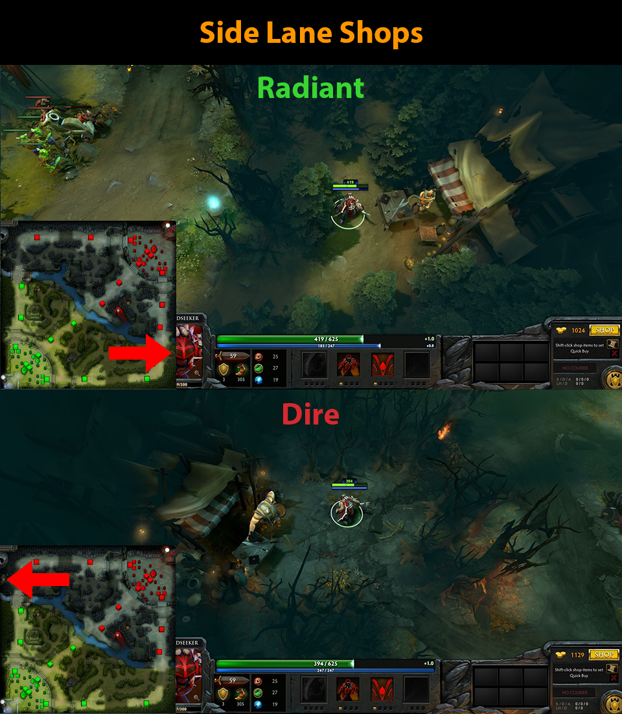

## Меню лавки

Ваш герой должен находиться около лавки, чтобы купить предмет. Есть несколько способов открыть меню лавки.

* На клавиатуре нажать горячую клавишу "Открыть Лавку" (Open Shop).
* Нажать на кнопку с текущим счётчиком вашего золота в правом нижнем углу окна игры. Цвет кнопки меняется в зависимости от вашей близости к лавке.
    * Около лавки: 

    * Слишком далеко от лавки: 

* Нажать левой кнопкой мыши по владельцу лавки.

Сначала использование магазина может показаться запутанным и сложным из-за количества доступных предметов.

При покупке предметов следует учитывать, что:

* Большинство предметов можно продать обратно в лавку. Чтобы это сделать, нажмите по предмету в вашем инвентаре, ранце или тайнике правой кнопкой мыши и выберите опцию "Продать" ("Sell").

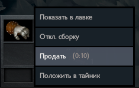

* Если вы продадите предмет в течении 10 секунд с момента его покупки, вы получите назад его полную стоимость.
* После 10 секунд с момента покупки можно продать предмет за половину его стоимости.
* Чтобы купить предмет из боковой или потайной лавки, вы должны находится около неё и иметь достаточно места в инвентаре или ранце.
* Купленный в основной лавке предмет помещается в тайник, если вы находитесь слишком далеко от неё или в вашем инвентаре и ранце нет места.

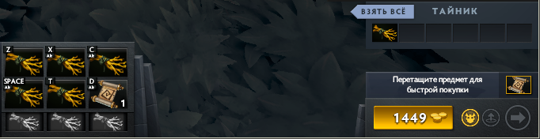

* Вы можете перекладывать предметы из инвентаря/ранца в тайник и обратно, когда окажетесь около фонтана.

Рассмотрим меню лавки и его элементы.

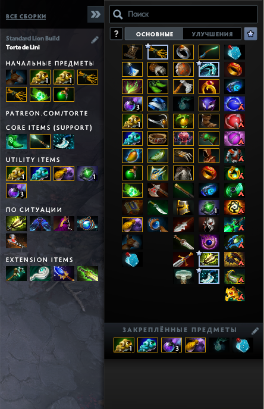

* **Вкладки "Основные" (Basics) и "Улучшения" (Upgrades)**
Предметы в лавке разбиты на две вкладки - "Основные" и "Улучшения".

* **Поиск (Search Bar)**
В верхней части меню лавки находится строка поиска. Введя в неё название предмета, вы получите список совпадений. Вам следует использовать эту функцию, когда вам не удаётся найти нужный предмет.

* **Рекомендуемые предметы (Suggested Items)**
В левой части меню лавки находится панель с рекомендуемыми для вашего героя предметами. Эти предметы разделены на категории (начальные (starting), основные (core) и т.д.) в зависимости от порядка их приобретения. Список рекомендуемых предметов зависит от выбранной вами **сборки** (guide)

* **Сборки (Guides)**
В верхней части панели рекомендуемых предметов есть кнопка "ВСЕ СБОРКИ" (BROWSE ALL GUIDES). При нажатии на неё откроется диалог, в котором можно выбрать одну из нескольких сборок предметов для вашего героя. 
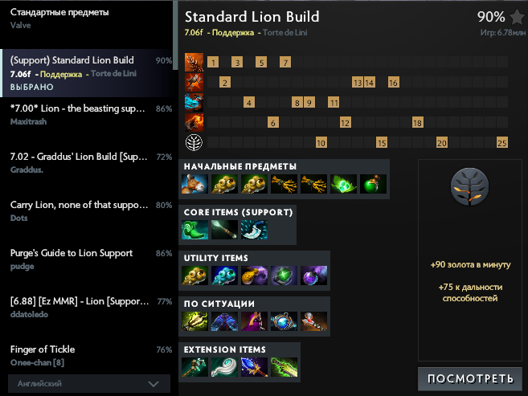
    * По-умолчанию будет активна сборка "Стандартные предметы" от разработчиков игры. Кроме неё есть много сборок от других игроков.
    * Сборки отсортированы по популярности их использования другими игроками. Самая популярная идёт сразу после стандартной.
    * Сборка определяет не только список рекомендуемых предметов, но и порядок улучшения способностей героя. Рекомендуемая для улучшения способность выделяется оранжевой рамкой при получении вами уровня. 
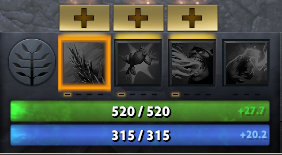

## Покупка предмета

Купить предмет в лавке довольно просто.

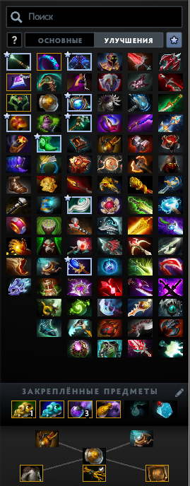

* При нажатии левой кнопокой мыши по иконке предмета в меню лавки вы увидите, из каких компонентов он состоит, и в какой улучшеный предмет он может быть собран. Эта информация отображается в виде дерева в нижней части меню лавки.

* Предмет покупается по нажатию правой кнопки мыши по иконке предмета в любой панели меню лавки, если у вас достаточно золота.

* Если вы покупаете улучшаемый предмет, и у вас уже есть некоторые его компоненты, нажатие правой кнопки мыши по предмету в меню лавки приведёт к покупке только недостающих компонентов.

* Нажатие правой и левой кнопок мыши в дереве предмета работает так же, как описано выше.

* Если вы купили компонент улучшаемого предмета, то в дереве предмета он будет помечен белой галочкой.

## Закреплённый предмет (Sticky Buy)

Эта функция позволяет вам перетащить левой кнопкой мыши какой-то предмет в закреплённый слот (sticky slot) и покупать его без открытия меню лавки. Чтобы купить закреплённый предмет нажмите по нему правой кнопкой мыши или воспользуйтесь горячей клавишей "Купить закреплённый предмет".

По-умолчанию в начале матча закрплённым предметом становится Town Portal Scrolls.

## Быстрая покупка (Quickbuy)

В панель быстрой покупки можно добавить предметы, чтобы купить их позже. 

Есть два способа добавить предмет:

* Зажать клавишу *Shift* и нажать левой кнопкой мыши по предмету в меню лавки.
* Перетащить предмет мышью из меню лавки на панель быстрой покупки.

Замечания по работе быстрой покупки:

* Если вы добавили улучшаемый предмет, все его компоненты будут доступны через быструю покупку.
* Чтобы купить добавленный предмет, нажмите по его иконке правой кнопкой мыши или воспользуйтесь горячей клавишей "Быстрая покупка".
* При покупке предмета, он будет удален с панели быстрой покупки.
* Предмет поместиться в тайник, если во время покупки ваш герой находился далеко от лавки.

Пример панели быстрой покупки (пустая и с добавленными предметами):

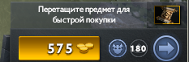

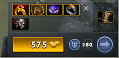
