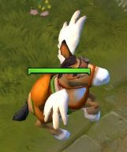
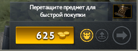
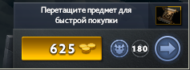
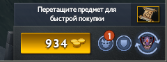
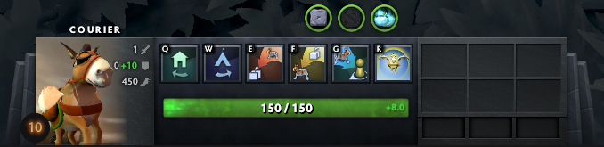

# 13. Курьер

## Курьер (Animal Courier)

 [**Animal Courier**](https://dota2-ru.gamepedia.com/Animal_Courier) (Курьер) - это расходуемый предмет, который один из игроков команды должен купить в начале матча. Задача курьера - покупать предметы в лавке и относить их союзным героям.

Предмет Animal Courier продаётся в основной лавке за 200 золота. Когда герой использует этот предмет, около него возникает существо курьер:

Управлять курьером и применять его способности может любой игрок команды, которой он принадлежит.

Без курьера герой должен подходить к лавке каждый раз, когда ему нужно купить предмет. Курьер делает это вместо вас. 

Чтобы приобрести предмет через курьера:
* Выделите курьера нажатием по нему левой кнопкой мыши или по горячей клавише "Выбрать курьера".
* Отправьте курьера к лавке.
* Купите предмет в меню лавки.
* Купленный предмет попадёт в инвентарь курьера.
* Дайте курьеру команду передать предметы вашему герою.

Использовать курьера для покупки предметов очень полезно. Это экономит герою время на перемещение к лавке, позволяя вместо этого оставаться на линии, получать опыт и золото или выполнять другие задачи (например, ганк или атака башен). В начале матча курьер особенно полезен, потому что в этой фазе игры вы должны оставаться на линии как можно дольше для быстрой прокачки вашего героя.

Если ваш герой слишком часто перемещается к фонтану для восстановления здоровья и приобретения предметов, он будет отставать от остальных по уровню и золоту.

## Летающий курьер (Flying Courier)

Курьер автоматически улучшается на третьей минуте матча (3:00 на игровом таймере) до [**летающего курьера**](https://dota2-ru.gamepedia.com/Flying_Courier) (Flying Courier).

Летающий курьер двигается быстрее и преодолевает препятствия (например скалы и стены), которые обычный курьер обходит. У улучшенного курьера есть способность **Щит** (Shield), которая делает его неуязвимым на 2 секунды.

## Использование курьера

Когда курьер никем не используется, он должен находиться около основной лавки. Если кому-либо в команде понадобился предмет из потайной лавки, курьера можно переместить к ней.

**Не позволяйте вашему курьеру умереть. Убивайте курьера противника при любой удобной возможности.**

Использовать курьера следует с осторожностью. Каждый игрок команды противника получает 175 золота, если им удалось убить курьера. Это значительная сумма. Для сравнения, уничтожение у противника башни 1-ого уровня даёт каждому игроку команды 160 золота.

После смерти курьер возрождается через 3 минуты. Все предметы в его инвентаре будут недоступны в течении этого времени. Курьер является высокоприоритетной целью для команды противника из-за высокой награды за его убийство и потенциального вреда от недоступности переносимых им предметов.

При управлении курьером вы должны всегда контролировать его месторасположение и держать его подальше от опасных областей, где могут быть герои противника. Всегда отправляйте его к фонтану, как только он доставил вам предметы.

Курьер может переносить вам предметы из тайника и обратно.

## Интерфейс курьера

Текущее состояние курьера отображается на специальной панели в правом нижнем углу экрана.

* У команды нет курьера:

* У команды есть обычный или летающий курьер:

* Курьер несёт предметы герою:

* Панель способностей курьера: 

    * Q - вернуться на базу.
    * W - переместиться в потайную лавку.
    * E - вернуть предметы в тайник.
    * F - забрать предметы из тайника.
    * G - отнести предметы герою.
    * R - создать щит вокруг курьера.

С помощью горячих клавиш вы можете управлять курьером, не перемещая камеры с вашего героя.

## Алгоритм использования

Ниже приведена наиболее частая последовательность действий для покупки предмета и доставки его курьером:

* Выберите курьера (горячая клавиша "Выбрать курьера").
* Проверьте, что курьер находится около лавки, в который вы собираетесь сделать покупку.
    * Q - вернуть курьера к основной лавке.
    * W - переместить курьера к потайной лавке.
* Открыть меню лавки (горячая клавиша "Открыть лавку").
* Купить нужный предмет.
* Отнести предметы герою (горячая клавиша "Курьер - доставить предметы").
