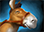
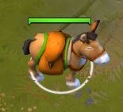

# 13. Курьер

## Animal Courier

 [**Animal Courier**](https://dota2-ru.gamepedia.com/Animal_Courier) (Курьер) - это расходуемый предмет, который один из игроков команды должен купить в начале матча. Задача курьера - покупать предметы в лавке и передавать их союзным героям.

Предмет Animal Courier продаётся в основной лавке за 200 золота. Когда герой использует этот предмет, около него возникает существо курьер:

Управлять курьером и применять его способности может любой игрок команды, которой он принадлежит.

Без курьера герой должен подходить к лавке каждый раз, когда ему нужно купить предмет. Курьер делает это вместо вас. 

Чтобы приобрести предмет через курьера:
* Выделите существо курьер нажатием по нему левой кнопкой мыши или по горячей клавише "Выбрать курьера".
* Отправьте курьера к лавке.
* Купите предмет в меню лавки.
* Купленный предмет попадёт в инвентарь курьера.
* Дайте курьеру команду передать предметы вашему герою.

Использовать курьера для покупки предметов очень полезно. Это экономит герою время на перемещение к лавке, позволяя вместо этого оставаться на линии, получать опыт и золото или выполнять другие задачи (например, ганк или атака башен). В начале матча курьер особенно полезен, потому что в этой фазе игры вы должны оставаться на линии как можно дольше для быстрой прокачки вашего героя.

Если ваш герой слишком часто перемещается к фонтану для восстановления здоровья и приобретения предметов, он будет отставать от остальных по уровню и золоту.

