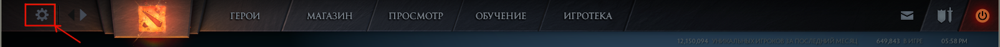
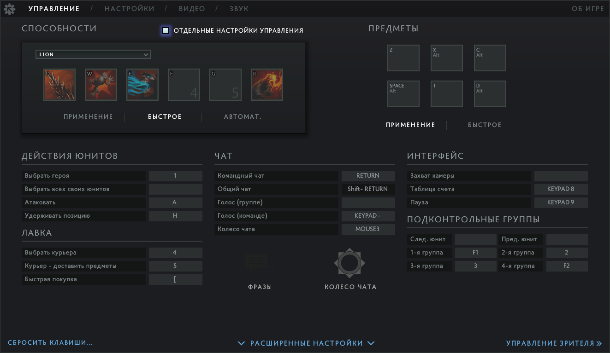

# 14. Управление игрой и настройки

## Горячие клавиши

Горячие клавиши (Hotkeys) позволят вам максимально эффективно использовать клавиатуру. Они освободят мышь для выполнения более важных действий. Кроме того, горячие клавиши быстрее нажимать, чем перемещать мышь на нужную кнопку в интерфейсе игры.

## Меню настроек

Изменить привязку горячих клавиш можно в меню настроек игры. Чтобы открыть это меню, щёлкните мышью по шестерёнке в окне игры:

### Основные настройки

Окно основных настроек управления:

Наиболее важные горячие клавиши в этом меню:

* **Выбрать героя** (Select Hero) - выделить вашего героя. При двойном нажатии клавиши, камера переместится на него.
* **Выбрать всех своих юнитов** (Select All Controlled Units) - выделить всех принадлежащих вам существ и героя. Для большинства героев эта команда не нужна.
* **Атаковать** (Attack Move) - нажав эту горячую клавишу и кликнув по цели, вы прикажете выделенным в данный момент существам атаковать вражеских героев, крипов или здания.
    * Правое нажатие мыши также даст команду атаковать цель.
    * Если вы нажали на эту горячую клавишу и ещё не выбрали цель, команду можно отменить по правой кнопке мыши.
    * Эта команда может быть полезна для добивания союзного крипа или героя.
* **Удерживать позицию** (Hold Position) - отменить текущее действие и оставаться на месте.
* **Выбрать курьера** (Select Courier) - выделить курьера вашей команды. При двойном нажатии клавиши, камера переместится на него.
* **Курьер - доставить предметы** (Courier Deliver Items) - команда совмещает вызов способностей курьера "Забрать предметы" и "Передать предметы". В результате курьер отправится к фонтану, заберёт все предметы из тайника и отнесёт их вашему герою.
* **Подконтрольные группы** (Control Groups) - набор горячих клавиш для выделения групп существ, произвольно заданных в процессе игры.
    * Команды особенно полезны для героев, которые призывают существ.
    * Чтобы задать группу:
        * Выделите несколько существ мышкой.
        * Нажмите Ctrl+2, где *2* - это привязанная к номеру группы клавиша.
        * Теперь по нажатию клавиши *2* будет выделена заданная группа.
* **Способности** (Abilities) - панель, где задаются горячие клавиши для использования способностей.
    * Есть три режима использования способностей:
        * **Применение** (Cast) - стандартный способ при котором сначала выбирается способность, а затем нажатием мыши указывается цель.
        * **Быстрое** (Quickcast) - при нажатии на горячую клавишу способность будет применена на цель, которая находится в данный момент под курсором мыши.
        * **Автомат** (Autocast) - включить использование [**авто-применяемой**](https://dota2-ru.gamepedia.com/%D0%A1%D0%BF%D0%BE%D1%81%D0%BE%D0%B1%D0%BD%D0%BE%D1%81%D1%82%D0%B8#.D0.90.D0.B2.D1.82.D0.BE-.D0.BF.D1.80.D0.B8.D0.BC.D0.B5.D0.BD.D1.8F.D0.B5.D0.BC.D1.8B.D0.B5) способности.
    * Для каждой способности в каждом из трёх режимов применения можно задать свою горячую клавишу. Для этого сначала выберите нужный режим, затем нажмите по иконке способности и по горячей клавише, к которой она будет привязана.
* **Предметы** (Items) - набор горячих клавиш для использования предметов в инвентаре героя.
    * У предметов есть два режима использования: применение и быстрое. Они работают так же, как аналогичное применение способностей.
    * Клавиши для предметов настраиваются так же, как для способностей героя.

### Расширенные настройки

Окно расширенных настроек управления:

Наиболее важные горячие клавиши в этом меню:

* **Идти** (Move) - приказать выделенным в данный момент существам двигаться в указанную точку. Для этого надо нажать горячую клавишу и кликнуть левой кнопкой мыши по цели.
    * Правое нажатие мыши даст ту же команду двигаться к цели.
* **Отменить текущее действие** (Stop) - выделенные существа остановятся.
* **Открыть лавку** (Open Shop) - открыть меню лавки.
