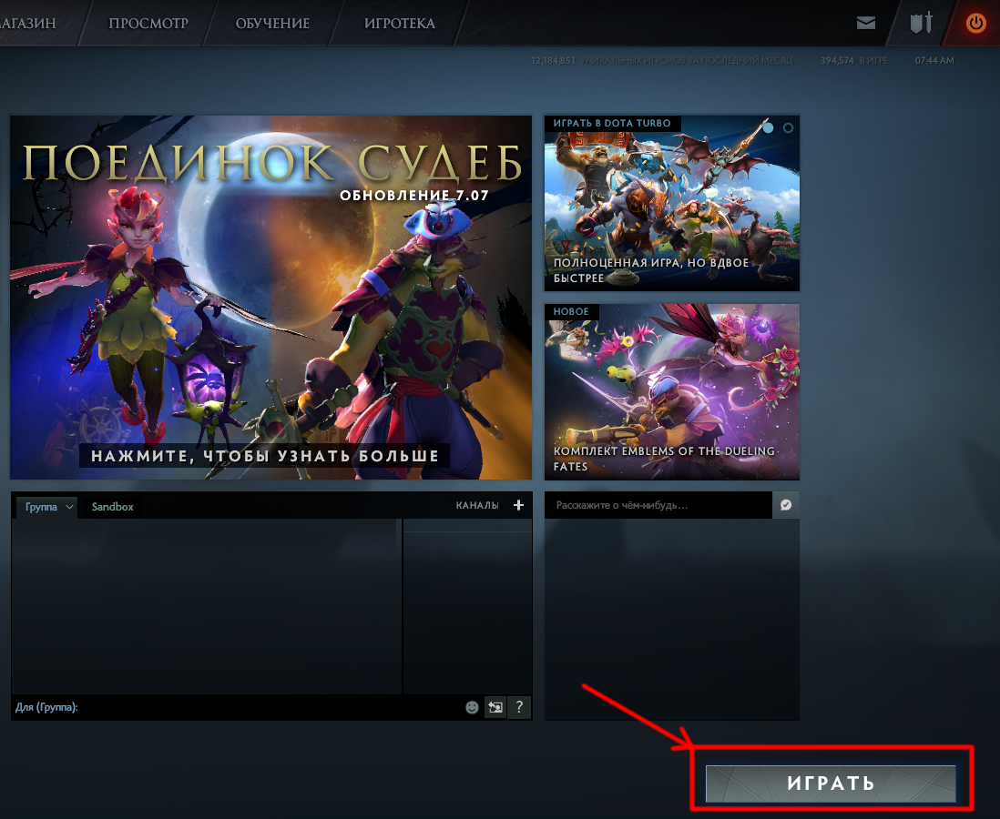
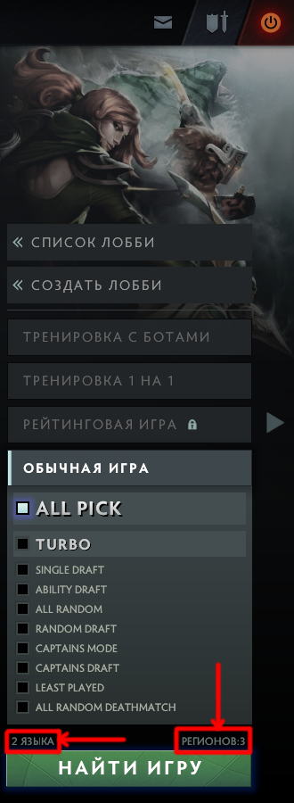

# 15. Поиск вашего первого матча

* Запустите Dota 2.
* Нажмите кнопку "Играть" в правом нижнем углу:

* В открывшейся панели выберите **режим** "Обычная игра", чтобы начать матч с другими игроками.
    * Новым игрокам рекомендуется сыграть в первый раз против ботов. Для этого вместо режима "Обычная игра" надо выбрать режим "Тренировка с ботами". Играйте с ботами пока не освоитесь с основами управления, игровой механикой, героями, способностями и предметами.
    * Боты хорошо наносят последний удар по крипам, особенно на высокой сложности. Они также умеют делать цепочку оглушений и других обезвреживаний.
    * После начальной фазы игры они перемещаются группой и действуют, как одна команда.
    * Даже если вы проигрываете ботам, вы можете попробовать сыграть с людьми. Главное, чтобы вы понимали игровую механику, управление и основы стратегии.
* Выберите "Регион" и "Язык":

* Нажмите кнопку "Найти игру" внизу панели.
* Когда подходящий матч будет найден, вы увидите диалог подтверждения с кнопкой "Принять". Вы подключитесь к матчу и увидите его меню, когда все десять игроков подтвердят своё участие.
* У каждого игрока есть две минуты, чтобы подключиться к матчу.
* Если один из игроков не подтвердил свое участие, матч отменяется и происходит поиск другого матча.

После того как вы и остальные игроки подключились к первому матчу, вам нужно выбрать своего героя.

* Фаза выбора героя начинается как только все десять игроков подключатся к матчу.
* Набор и количество доступных героев, порядок, в котором игроки их выбирают, зависит от заданного вами режима игра.

Важное замечание: Не покидайте игры до её окончания. Отказавшиеся от игры участники матча попадают в низкооприоритетную очередь, состоящую из других "вышедших". Игроки с низким приоритетом будут учавствовать в матчах только друг с другом. Нахождение в этой очереди может продолжаться до одного дня. Поэтому всегда рассчитывайте на длительность матча от 45 минут до часа, чтобы не приходилось покидать игру.

## Режимы игры

При поиски матча вы можете выбрать один или несколько желаемых [**режимов игры**](https://dota2-ru.gamepedia.com/%D0%98%D0%B3%D1%80%D0%BE%D0%B2%D1%8B%D0%B5_%D1%80%D0%B5%D0%B6%D0%B8%D0%BC%D1%8B).

Список режимов:

All Pick (AP)

* Каждый игрок выбирает из всех героев.
* Герой становится недоступен, когда кто-то из игроков его выбрал. Если игрок меняет свой выбор (re-pick).
* Доступен вариант выбора случайного героя. Игрок, получивший случайного героя, начинает матч с дополнительными 200 золота (850 в сумме).
* Можно выбрать другого героя, независимо от того был ли это случайный выбор или его сделал игрок.
* Повторынй выбор отменяет бонус золота за случайного героя и отнимает у игрока 100 золота в начале матча (525 в сумме).

