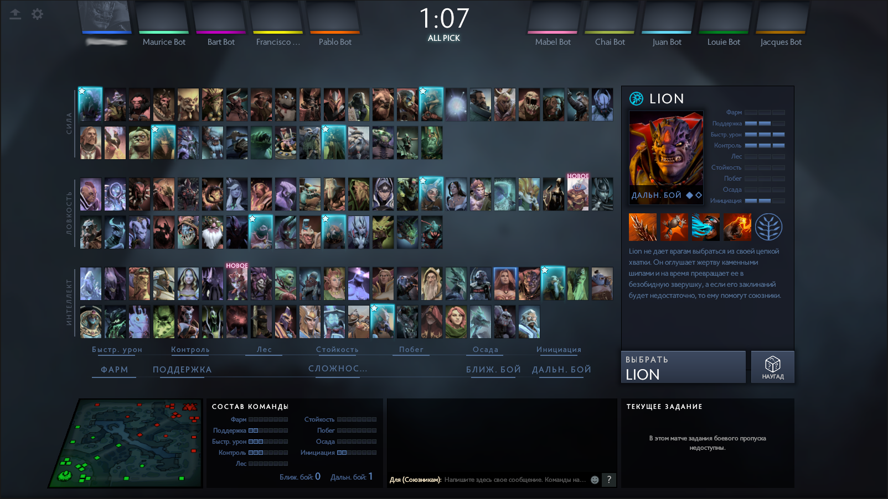

# 16. Выбор героя и состав команды

Вы и остальные игроки подключились к вашему первому матчу. Следующий шаг, который вы должны сделать - это выбрать своего героя.

Замечания по выбору героя:

* Фаза выбора героя начинается, как только все игроки подключились к матчу.
* В некоторых режимах игры перед выбором героев идёт стадия запретов героев (банов).
* Расположение героев в меню выбора, их количество и порядок зависят от режима игры.
* В режиме All Pick игрок может выбрать любого героя, кроме запрещённых. Когда герой выбран, никто больше не сможет выбрать его повторно.

Вопросы, которые следует учитывать при выборе героя:

* Сложно ли играть за этого героя?
* Герой какой роли нужен моей команде?

## Состав команды

Во время выбора героев вы и ваша команда должны учитывать следующее:

* Кто и с каким героем пойдёт на **среднюю линию** (мид, mid)?
* Кто-нибудь выбрал лесника?
    * Если да, вы не должны выбирать героя с этой ролью.
    * Выбрал ли кто-нибудь героя, который хорошо подходит для боковой линии? Как правило, это герои роли побег.
* Кто играет за кэрри?
    * Вам не следует выбирать больше одного кэрри (hard carry) в команду. Иначе ваша команда будет слишком слаба в начале и середине матча.
* Кто играет за саппорта?
    * Саппорт должен идти на ту же линию, что и кэрри.
* Каков ваш потенциал в командных боях, ганге и пуше?
    * Состав команды не может быть идеальным для всех трёх задач. Важно, чтобы вы отыгрывали сильные стороны своей команды.
    * Какие способности обезвреживания (дизэйблы) у вас есть? Чем больше, тем лучше.
* Не выбирайте двух героев ближнего боя на одну линию.
* Два дизэйблера на линии могут быть очень сильны. Их способности позволят совершить несколько убийств в начале матча.

