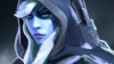

# 16. Выбор героя и состав команды

Вы и остальные игроки подключились к вашему первому матчу. Следующий шаг, который вы должны сделать - это выбрать своего героя.

Замечания по выбору героя:

* Фаза выбора героя начинается, как только все игроки подключились к матчу.
* В некоторых режимах игры перед выбором героев идёт стадия запретов героев (банов).
* Расположение героев в меню выбора, их количество и порядок зависят от режима игры.
* В режиме All Pick игрок может выбрать любого героя, кроме запрещённых. Когда герой выбран, никто больше не сможет выбрать его повторно.

Вопросы, которые следует учитывать при выборе героя:

* Сложно ли играть за этого героя?
* Герой какой роли нужен моей команде?

## Состав команды

Во время выбора героев вы и ваша команда должны учитывать следующее:

* Кто и с каким героем пойдёт на **среднюю линию** (мид, mid)?
* Кто-нибудь выбрал лесника?
    * Если да, вы не должны выбирать героя с этой ролью.
    * Выбрал ли кто-нибудь героя, который хорошо подходит для боковой линии? Как правило, это герои роли побег.
* Кто играет за кэрри?
    * Вам не следует выбирать больше одного кэрри (hard carry) в команду. Иначе ваша команда будет слишком слаба в начале и середине матча.
* Кто играет за саппорта?
    * Саппорт должен идти на ту же линию, что и кэрри.
* Каков ваш потенциал в командных боях, ганге и пуше?
    * Состав команды не может быть идеальным для всех трёх задач. Важно, чтобы вы отыгрывали сильные стороны своей команды.
    * Какие способности обезвреживания (дизэйблы) у вас есть? Чем больше, тем лучше.
* Не выбирайте двух героев ближнего боя на одну линию.
* Два дизэйблера на линии могут быть очень сильны. Их способности позволят совершить несколько убийств в начале матча.

## Хорошие герои для новичков

Описанные ниже герои рекомендуются для новичков. Их способности легко понять и просто использовать, а стиль игры этих героев относительно несложный. Они обладают одним из следующих качеств: хорошая живучесть, большой урон, хорошие способности обезвреживания или ими легко приносить пользу в командных боях.

Имя героя - Основной параметр - Роль

*  [**Wraith King**](https://dota2-ru.gamepedia.com/Wraith_King) - Сила - Ближний бой, Танк, Кэрри, Дизэйблер.
    * Имеет только одну активную способность - оглушение.
    * Ульта представляет собой бесплатный Aegis, когда она перезаряжена.

*  [**Lich**](https://dota2-ru.gamepedia.com/Lich) - Интеллект - Дальний бой, Саппорт, Саппорт на линии, Нюкер.
    * Относительно высокая базовая скорость передвижения.
    * Имеет четыре активных, но простых в применении способности.
    * За счёт второй способности нет недостатка в мане.
    * Ульта наносит сильный магический урон.

*  [**Sven**](https://dota2-ru.gamepedia.com/Sven) - Сила - Ближний бой, Дизэйблер, Инициатор, Кэрри, Саппорт.
    * Имеет три простые в использовании активные способности.
    * Первая способность - это хорошее оглушение по области (AoE).
    * Вторая пассивная способность позволяет наносить урон обычной атакой по области, что облегчает фарм.
    * Третья способность усиливает союзников (AoE buff), увеличивая скорость их передвижения и броню.
    * Ульта является простым усилением (buff) урона.

*  [**Tidehunter**](https://dota2-ru.gamepedia.com/Tidehunter) - Сила - Ближний бой, Инициатор, Танк.
    * Имеет три простые активные способности.
    * Первая способность наносит урон по одной цели и накладывает дебафф.
    * Третья способность наносит урон по небольшой области и накладывает дебафф.
    * Ульта представляет собой оглушение по огромной области (1025 единиц), которое также наносит урон. Очень эффективна в командных боях.

*  [**Drow Ranger**](https://dota2-ru.gamepedia.com/Drow_Ranger) - Ловкость - Дальний бой, Кэрри.
    * Имеет две активные способности и две пассивные (одна из которых аура).
    * Пассивные способности позволяют герою наносить большой урон.

*  [**Venomancer**](https://dota2-ru.gamepedia.com/Venomancer) - Ловкость - Дальний бой, Саппорт, Нюкер, Инициатор, Пушер.
    * Хорошие способности с периодическим уроном (damage over time, DoT).
    * Первая способность - сильное замедление, которое поражает врагов, находящихся на одной линии.
    * Третья способность позволяет размещать особые варды (Plague Ward), которые помогают при пуше и обороне. Она имеет быстрое время перезярядки и малую стоимость маны.
    * Мощная ульта наносит периодический урон и мешает вражеским героям восстанавливать здоровье.

*  [**Lion**](https://dota2-ru.gamepedia.com/Lion) - Интеллект - Дальний бой, Дизэйблер, Нюкер, Саппорт, Саппорт на линии.
    * Имеет две хорошие способности обезвреживания. Одна из них оглушение, а другая проклятье (hex).
    * Нет недостатка в мане за счёт второй способности, вытягивающей ману (mana drain) у одной цели.
    * Ульта наносит мощный урон по одной цели.

*  [**Ogre Magi**](https://dota2-ru.gamepedia.com/Ogre_Magi) - Интеллект - Ближний бой, Нюкер, Дизэйблер, Танк.
    * Имеет хорошие способности с магическим уроном по одной цели.
    * Первая способность - оглушение цели, которое также наносит урон.
    * Вторая способность - замедление цели с нанесением урона.
    * Третья способность - баф одного союзника, который увеличивает скорость передвижения и атаки.
    * Пассивная ульта даёт шанс применять другие способности несколько раз за одно использование.

*  [**Juggernaut**](https://dota2-ru.gamepedia.com/Juggernaut) - Ловкость - Ближний бой, Кэрри, Пушер.
    * Первая способность наносит хороший магический урон находящимся вокруг существам в течении своего времени воздействия.
        * Также во время использования способности герой получает иммунитет к магии.
    * Вторая способность призывает вард (Healing Ward), который лечит героя и союзников поблизости (AoE эффект).
    * Пассивная тертья способность даёт шанс нанести двойной урон обычной атакой.
    * С помощью ульты герой наносит несколько мощных ударов по врагам.
        * Во время действия способности герой становится неуязвимым.
