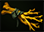
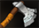
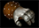
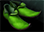

# 17. Подготовка к матчу и начальные предметы

Матч начнётся, когда таймер, отведённый на фазу выбора героя, достигнет нуля. Вы войдёте в игру, и ваш герой появится около фонтана.

Первые волны крипов появятся через 90 секунд после начала матча. За это время вы должны сделать следующие вещи:

* Купить начальные предметы.
* Вложить первое очко способностей (skill point).
* Разместить на карте Observer Ward, если вы его купили.
* Переместиться на свою линию или в лес.
    * Скорее всего, вы не увидите этого в своих играх, но на высоких уровнях турнирных игр команды часто собираются вместе и перемещаются по карте, чтобы устроить ганг или командный бой. После этого они распределяются по своим линиям.

С начала матча игровой таймер ведёт обратный отсчёт. Через 90 секунд он достигнет отметки 0:00. В этот момент прозвучит горн, первые волны крипов появятся у казарм и двинутся по своим линиям на противника. Теперь игровой таймер растёт и отсчитывает время, прошедшее с момента звука горна.

## Начальные предметы

Одно из действий, которое вы должны совершить перед появлением первой волны крипов, - это покупка начальных предметов.

Новички должны ориентироваться на список начальных предметов в меню лавки.

Важное замечание: один из саппортов вашей команды обязательно должен купить курьера в качестве начального предмета. Однако, если курьера никто не купил, это должны сделать вы, независимо от вашей роли.

Далее в этом разделе обсуждаются причины выбора тех или иных начальных предметов. Эти вещи не являются обязательными для изучения, но они помогут вам адаптировать начальные предметы к каждой конкретной игре и правильно подобрать предметы для ещё незнакомых вам героев.

Выбор начальных предметов зависит от нескольких факторов:
* На какой линии вы стоите?
* За какого героя играете вы и ваш противник на линии?
* Как вы собираетесь прокачивать своего героя?

Общая рекомендация: вы должны приобретать что-то для восстановления здоровья и дешёвые предметы на повышение параметров. Регенерация, которую дают предметы Healing Salves, Tangos, и Clarities, позволит вам дольше оставаться на линии в начале игры и выдерживать нападения ([**харас**](https://dota2-ru.gamepedia.com/%D0%90%D0%B3%D1%80%D0%B5%D1%81%D1%81%D0%B8%D1%8F)) противника. После покупки нескольких предметов для лечения (обычно Tango и Salve или два Tango), остальные слоты инвентаря должны заполняться дешевыми предметами на повышение параметров. Они дадут вашему герою увеличение атрибутов, которое приведёт к увеличению его уровней здоровья и маны, а также урона. Это сделает вашего героя сильным настолько, насколько это возможно в самом начале игры, и даст преимущество над противником.

Если вы играете за героя поддержки, вам следует покупать несколько Observer Wards и курьера.

**Три предмета с бонусом +1 к параметрам или предмет +3.** 
Предпочтительнее покупать несколько дешёвых предметов на увеличение параметров, чем один дорогой. Дешёвые предметы дают больший бонус в пересчёте на потраченное золото. Лучший предмет в этой категории -  [**Iron Branch**](https://dota2-ru.gamepedia.com/Iron_Branch). Он даёт +1 ко всем параметрам всего за 50 золота. При покупке дорогого предмета с большим бонусом, вы доплачиваете за экономию места в инвентаре. Но в начале игры ваш инвентарь пуст, и в такой экономии нет смысла.

Другие предметы, часто покупаемые в начале матча:

*  [**Quelling Blade**](https://dota2-ru.gamepedia.com/Quelling_Blade) (200 золота) - увеличивает на 24 урон против крипов для героев ближнего боя и на 7 -  для дальнего.
    * Часто покупается кэрри ближнего боя, чтобы легче наносить последний удар по крипам на линии.
    * Предмет имеет активную способность - срубить дерево. Она полезна, чтобы прорубать проходы в лесу.

*  [**Stout Shield**](https://dota2-ru.gamepedia.com/Stout_Shield) (200 золота) - даёт 50% шанс заблокировать 18 урона для героев ближнего боя и 9 для дальнего.
    * Часто покупается героями ближнего боя, которые стоят против героев дальнего боя на линии.

*  [**Ring of Protection**](https://dota2-ru.gamepedia.com/Ring_of_Protection) (175 золота) - даёт +2 к броне героя. Уменьшает урон, получаемый от крипов и вражеского героя.
    * Вместе с  [**Sage's Mask**](https://dota2-ru.gamepedia.com/Sage%27s_Mask) (325 золота) собирается в предмет  [**Ring of Basilius**](https://dota2-ru.gamepedia.com/Ring_of_Basilius).
    * Герои, которые собирают Ring of Basilius на начальной стадии матча, обычно покупают Ring of Protection, как начальный предмет. После этого недостающий для сборки Sage's Mask можно купить в боковой лавке на линии.
    * Также является компонентом  [**Tranquil Boots**](https://dota2-ru.gamepedia.com/Tranquil_Boots). (Все предметы типа Boots описаны в разделе "Фазы матча").

*  [**Gauntlets of Strength**](https://dota2-ru.gamepedia.com/Gauntlets_of_Strength),  [**Slippers of Agility**](https://dota2-ru.gamepedia.com/Slippers_of_Agility),  [**Mantle of Intelligence**](https://dota2-ru.gamepedia.com/Mantle_of_Intelligence) (135 золота) - эти предметы дают бонус +3 к одному параметру. Они не так выгодны для покупки, как Iron Branch, но их часто покупают для сборки других дешёвых предметов.

*  [**Circlet**](https://dota2-ru.gamepedia.com/Circlet) (165 золота) - даёт бонус +2 ко всем параметрам. Стоит более чем в три раза дороже, чем Iron Branch. Имеет смысл покупать только с целью дальнейшей сборки в другой предмет. Также можно купить, если у вас есть золото и не хватает места в инвентаре для двух Iron Branch.

Следующее видео объясняет на что вы должны обращать внимание при выборе начальных предметов:

