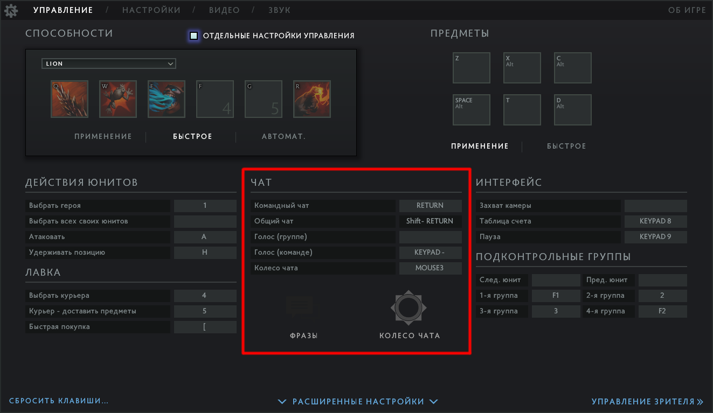
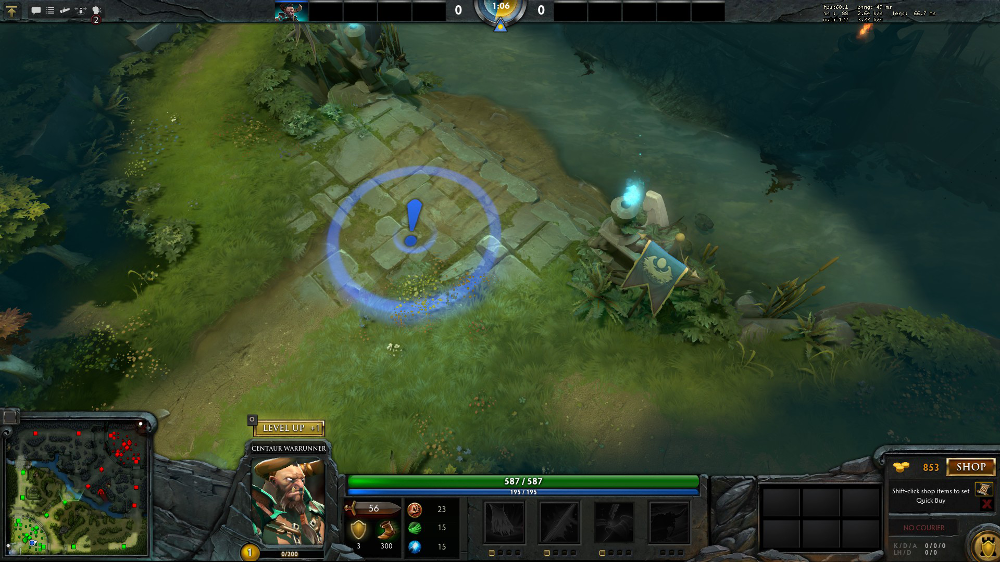
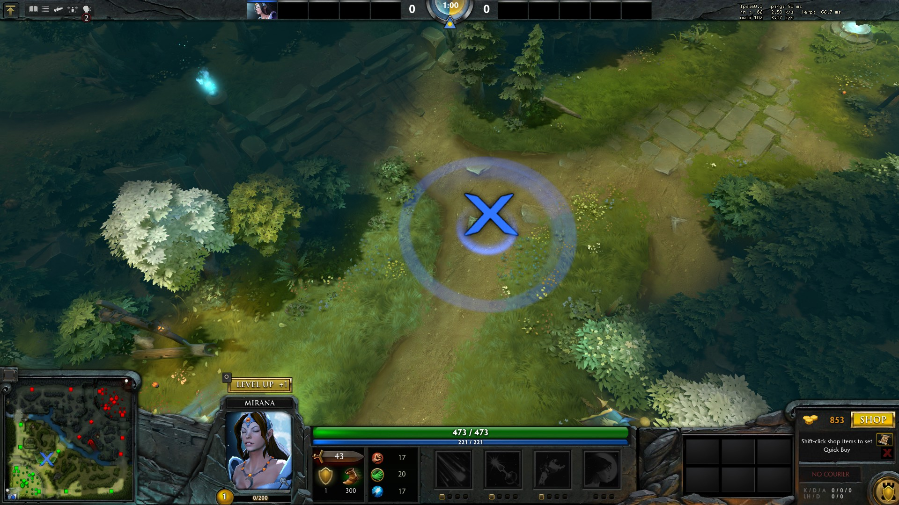
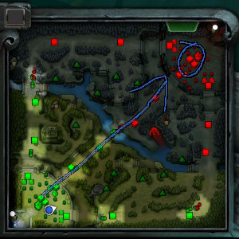
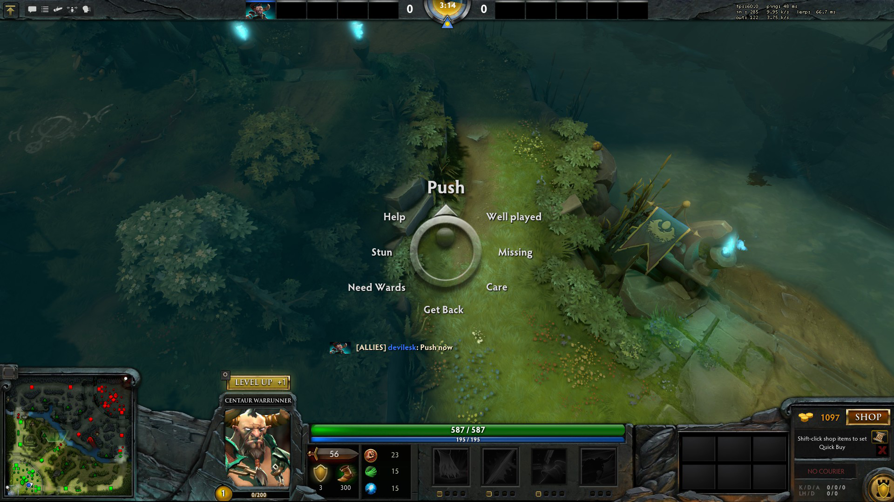

# 18. Взаимодействие с командой

Dota 2 - это командная игра. Поэтому взаимодействие с командой является ключевым фактором успеха.

В игре есть пять способов сообщить информацию другим игрокам:

* **Голос** (Voice) - лучший способ общаться с командой - это микрофон, если он у вас есть. Для включения микрофона используйте горячую клавишу "Голос (команде)".

* **Сообщение в чате** (Chat Message) - по нажатию клавиши "Командный чат" (по умолчанию *Enter*) вы можете напечатать сообщение своей команде. Для его отправки нажмите *Enter* повторно.

* **Пинг** (Ping) - делая пинг, вы помечаете точку на карте восклицательным знаком для всех союзников. При этом они услышат сигнал тревоги. Чтобы сделать пинг зажмите *Alt* и кликните левой кнопкой мыши по миникарте или земле. Вы также можете пинговать строения и героев.

    * **Пинг предупреждения** (Caution Ping) - отличается от обычного пинга звуком и отображается на карте как X. Используется для предупреждения союзников об опасности. Чтобы сделать такой пинг зажмите клавиши *Ctrl* + *Alt* и кликните левой кнопкой мыши по миникарте или земле.

* **Рисунок на миникарте** (Minimap Drawing) - вы можете рисовать на миникарте левой кнопкой мыши, зажав клавишу *Ctrl*. Такой рисунок полезен, чтобы указать союзникам направление атаки.
    * Рисунок на миникарте исчезает через несколько секунд.

* **Колесо чата** (Chat Wheel) - позволяет отправлять союзникам заранее подготовленные сообщения. Чтобы отправить такое сообщение:
    * Нажмите горячую клавишу "Колесо чата". В центре экрана вы увидите круг с доступными сообщениями.
    * Наведите курсор мыши на нужное сообщение, не отпуская горячей клавиши.
    * Когда курсор будет на нужном сообщении, отпустите горячую клавишу для его отправки.

Часто используемые аббревиатуры в чате:

* missing, mia, ss - 
