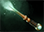
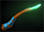
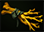
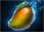

# 19. Фазы матча

Матч начался. Итак, что вам следует знать и чего ожидать с 0 по 40 (и далее) минуту игры?

## Начало матча (Early Game)

Начало матча также называют линейной фазой (laning phase).

Из-за влияния механик последнего удара и добивания на получаемый опыт, в начале матча герои будут находиться в областях, где сражаются линейные крипы. Их главная задача на этом этапе игры - добивать союзных и вражеских крипов, получая за это опыт.

Есть много способов получения золота и опыта быстрее других игроков в линейной фазе. Вы узнаете о них, приобретя некоторый опыт игры.

Один из первых предметов, который вы купите, оказавшись на линии, - это  [**Boots of Speed**](https://dota2-ru.gamepedia.com/Boots_of_Speed) (400 золота). Boots of Speed увеличивают скорость передвижения героя, и их можно улучшить. Улучшенный предмет даст бонус к параметрам, а также имеет активную или пассивную способность.

*  [**Tranquil Boots**](https://dota2-ru.gamepedia.com/Tranquil_Boots) (950 золота) - имеют пассивную способность на регенерацию здоровья. Регенерация прерывается на 13 секунд если герой был атакован или атаковал сам.

*  [**Phase Boots**](https://dota2-ru.gamepedia.com/Phase_Boots) (1240 золота) - их активная способность увеличивает скорость передвижения и позволяет герою проходить сквозь других существ на короткий промежуток времени.

*  [**Power Treads**](https://dota2-ru.gamepedia.com/Power_Treads) (1350 золота) - даёт +10 к одному из параметров героя. Чтобы выбрать нужный вам параметр, активируйте способность предмета.

*  [**Arcane Boots**](https://dota2-ru.gamepedia.com/Arcane_Boots) (1300 золота) - их активная способность восстанавливает ману вам и находящимся поблизости союзникам.

*  [**Boots of Travel**](https://dota2-ru.gamepedia.com/Boots_of_Travel) (2400 золота) - их активная способность телепортирует героя к союзному строению или существу. Имеют общее время перезарядки с [Town Portal Scroll](https://dota2-ru.gamepedia.com/Town_Portal_Scroll).

Все компоненты Phase Boots, Arcane Boots и Power Treads могут быть куплены в боковой лавке. Это означает, что вы можете покупать и улучшать свои Boots, не покидая линию.

* Единственный компонент Tranquil Boots, который недоступен в боковой лавке - это Ring of Protection.

 [**Magic Wand**](https://dota2-ru.gamepedia.com/Magic_Wand) (400 золота) - другой отличный предмет, который следует покупать большинству героев в каждом матче.

* Собирается из  [**Magic Stick**](https://dota2-ru.gamepedia.com/Magic_Stick) (200 золота), двух  [**Iron Branch**](https://dota2-ru.gamepedia.com/Iron_Branch) (2x50 золота) и  [**Enchanted Mango**](https://dota2-ru.gamepedia.com/Enchanted_Mango) (100 золота).

* Большинство героев начинает матч с несколькими Iron Branch, что облегчает сборку Magic Stick.

* Magic Stick заряжается каждый раз, когда вражеский герой использует способность недалеко от вас. Когда предмет заряжен, вы можете использовать его и мгновенно получить 15 здоровья и маны за каждый заряд.

* Magic Stick может иметь до 10 зарядов.

* Magic Wand работает так же, как Magic Stick. Он может иметь до 17 зарядов.

* Не забывайте использовать предмет. Накопление зарядов и активация предмета в нужный момент может спасти вам жизнь.

## Середина матча (Mid Game)

* Как только герои обеих команд приобретут необходимые уровни и вещи, они начнут перемещаться по карте, гангать и пушить.
    *  [**Smoke of Deceit**](https://dota2-ru.gamepedia.com/Smoke_of_Deceit) (80 золота) - очень полезный предмет для быстрого и незаметного перемещения вашей команды по карте, через вражеский лес или в логово Рошана.
        * При использовании на 35 секунд делает невидимыми вас и всех союзников в радиусе 1025 единиц. Также даёт бонус к скорости перемещения.
        * Невидимость и бонус скорости прекращаются при приближении к вражескому герою или башне на расстояние 1025 единиц.
        * Существа под действием эффекта невидимы на миникарте. Также, средства обнаружения (например Sentry Ward) их не раскрывают.

* На этой стадии игры герой средней линии будет часто перемещаться на боковые линии и пытаться убить вражеских героев.

* Игроки начинают собираться в группы и вместе перемещаться по карте, чтобы уничтожить башню или убить вражеских героев, фармящих лес.

* Команды начинают бороться за контроль над картой. Это может выливаться в масштабные командные бои.

## Конец матча (Late Game)

* На этой стадии игры исход командных боёв решает результат матча, поскольку время возрождения увеличивается, а герои могут быстрее уничтожать вражеские башни и Рошана.

* Поражение в командном бою может означать потерю казарм или убийство Рошана вражеской командой.

* Кэрри герои достигают своей максимальной силы, в то время как остальные становятся слабее на их фоне.
