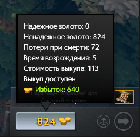
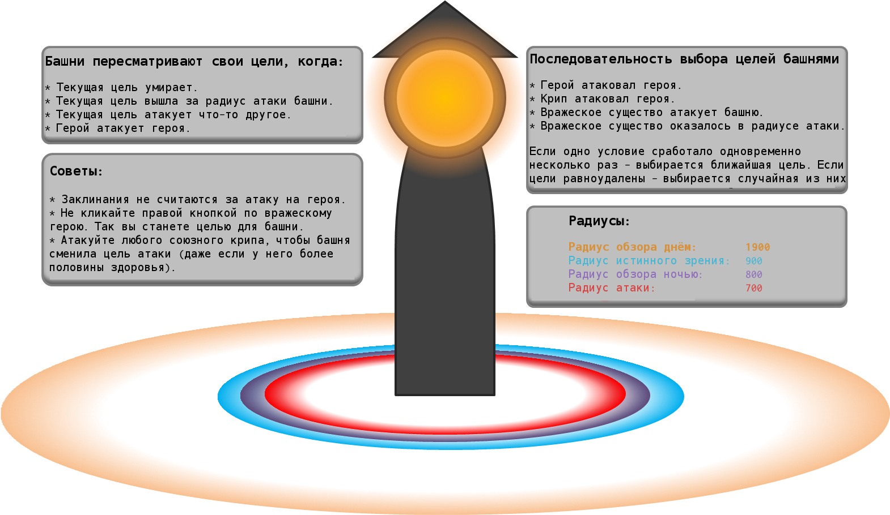

# 23. Продвинутая игровая механика

В этом разделе подробнее рассмотрены некоторые аспекты игры,  упомянутые ранее. Начинающие игроки могут не беспокоиться об этих вещах, поскольку они только учатся играть. Но эти тонкости следует изучить, как только вы познакомились с основами.

**Золото**

* На самом деле существует два типа золота - [**надёжное**](https://dota2-ru.gamepedia.com/%D0%97%D0%BE%D0%BB%D0%BE%D1%82%D0%BE#.D0.9D.D0.B0.D0.B4.D0.B5.D0.B6.D0.BD.D0.BE.D0.B5_.D0.B8_.D0.BD.D0.B5.D0.BD.D0.B0.D0.B4.D0.B5.D0.B6.D0.BD.D0.BE.D0.B5_.D0.B7.D0.BE.D0.BB.D0.BE.D1.82.D0.BE) (Reliable) и [**ненадёжное**](https://dota2-ru.gamepedia.com/%D0%97%D0%BE%D0%BB%D0%BE%D1%82%D0%BE#.D0.9D.D0.B0.D0.B4.D0.B5.D0.B6.D0.BD.D0.BE.D0.B5_.D0.B8_.D0.BD.D0.B5.D0.BD.D0.B0.D0.B4.D0.B5.D0.B6.D0.BD.D0.BE.D0.B5_.D0.B7.D0.BE.D0.BB.D0.BE.D1.82.D0.BE) (Unreliable). Их отличие в том, как вы его получаете и тратите.
    * Надёжное золото - это ваша награда за убийство или за помощь в убийстве (ассист, assist) вражеского героя.
        * Предмет Hand of Midas и способность Track также дают надёжное золото.
    * Ненадёжное золото - это все остальные награды и бонусы: пассивный прирост золота в секунду, руна богатства, убийство крипов (и Рошана), уничтожение строений.

* Надёжное золото не теряется после вашей смерти.

* Каждый раз, когда вас убивают, вы теряете 30*(уровень вашего героя) ненадёжного золота.

* При покупке предметов сначала тратится всё ненадёжное золото и только потом надёжное.

* Чтобы узнать количество вашего надёжного и ненадёжного золота, наведите курсор мыши на кнопку с счётчиком:

**Выкуп**

* При выкупе тратится сначала надёжное золото, а потом ненадёжное.

* После выкупа вы будете получать на 60% меньше ненадёжного золота (за крипов, руна богатства и и.д.) до тех пор, пока не пройдет ваше обычное время возрождения.

* После выкупа 25% оставшегося до возрождения времени будет добавлено ко времени возрождения после вашей следующей смерти.

**Добивания**

* Добитые крипы дают опыт только в радиусе 1000 единиц. Это меньше обычного радиуса 1300, на котором герои получают опыт за смерть крипов.

**Башни**

* При уничтожении башни награда золота, получаемая командой противника, зависит от тог, кто нанёс последний удар по строению.
    * Если последний удар нанёс крип - вся команда получает золото.
    * Если последний удар нанёс герой - вся команда получает меньше золота, а этот герой больше.

**Обзор**

* Время суток влияет на радиус обзора. 
[**Время суток**](https://dota2-ru.gamepedia.com/%D0%92%D1%80%D0%B5%D0%BC%D1%8F_%D1%81%D1%83%D1%82%D0%BE%D0%BA) - это элемент игры, сменяющий день на ночь и наоборот.
    * Полные сутки длятся 8 минут: 4 минуты на день и 4 минуты на ночь.
    * Первая ночь начинается на отметке 4:00 игрового таймера.
    * Радиус обзора днем и ночью у разных героев разный. У большинства он меньше ночью, чем днём.
    * Два героя могут управлять наступлением дня и ночи:
        * Night Stalker с помощью своей ульты [**Darkness**](https://dota2-ru.gamepedia.com/Night_Stalker#Darkness).
        * Luna с помощью своей ульты [**Eclipse**](https://dota2-ru.gamepedia.com/Luna#Eclipse).
* У большинства героев [**радиус обзора**](https://dota2-ru.gamepedia.com/%D0%9E%D0%B1%D0%B7%D0%BE%D1%80#.D0.94.D0.B0.D0.BB.D1.8C.D0.BD.D0.BE.D1.81.D1.82.D1.8C_.D0.BE.D0.B1.D0.B7.D0.BE.D1.80.D0.B0_.D0.B4.D0.BD.D0.B5.D0.BC_.D0.B8_.D0.BD.D0.BE.D1.87.D1.8C.D1.8E) днём составляет 1800 единиц, а ночью - 800.

[**Возвышенность**](https://dota2-ru.gamepedia.com/%D0%9E%D0%B1%D0%B7%D0%BE%D1%80#.D0.92.D0.BE.D0.B7.D0.B2.D1.8B.D1.88.D0.B5.D0.BD.D0.BD.D0.BE.D1.81.D1.82.D1.8C)

* Герои дальнего боя имеют 25% шанс промахнуться по цели, если она находится на возвышенности.

**Лагеря нейтральных крипов**

* Нейтральные крипы не возродятся в лагере, если в его области находится какое-то существо.

* Лагеря делятся на четыре типа, в зависимости от силы появляющихся там крипов: маленькие, средние, большие и древние.

* Вы можете [**стакнуть**](https://dota2-ru.gamepedia.com/Creep_Stacking) (собрать, stack) несколько групп крипов в области одного лагеря. Для этого надо выманить находящихся в нём крипов до наступления очередной минуты на игровом таймере. Подробности смотрите в разделе ["24. Лес"]().

* Также вы можете выманить нейтральных крипов на линию, чтобы на них напали ваши линейные крипы. Эта тактика называется пуллинг (pulling) и будет рассмотрена позднее.

* Одна и та же группа нейтральных крипов не может возродиться в одном лагере два раза подряд.

[**Агрессия**] (Агр, Aggression, Agro) крипов и башен - это правила, по которым они выбирают цели для атаки.

* Понимание механики агрессии крипов важно для эффективного хараса на вражеского героя на линии, а также стакинга и пуллинга крипов.

* Агрессия крипов:
    * Крип выбирает ближайшую к нему цель для атаки на расстоянии 500 единиц.
    * Каждые 2 секунды он проверяет наличие врага и может изменить цель атаки по следующему алгоритму:
        * В первую очередь атаковать ближайшего противника.
        * Если более близкой цели не появилось, продолжить атаковать текущую цель.
        * Катапульты в первую очередь атакуют башни и только потом крипов.
        * Несмотря на перечисленные условия, крипы всегда будут атаковать вражеского героя, который попытается атаковать героя их команды.
    * Нейтральные крипы "привязаны" к лагерю, в котором они появились. Они будут преследовать свою цель до определенного расстояния, а затем вернуться обратно в свой лагерь.
    * Линейные крипы не привязаны ни к чему и могут преследовать противника сколь угодно долго.

* Агрессия башни

Следующее картинка описывает приоритеты башни в выборе целей для атаки:

Следующее видео расскажет подробнее об агрессии крипов и башен:

