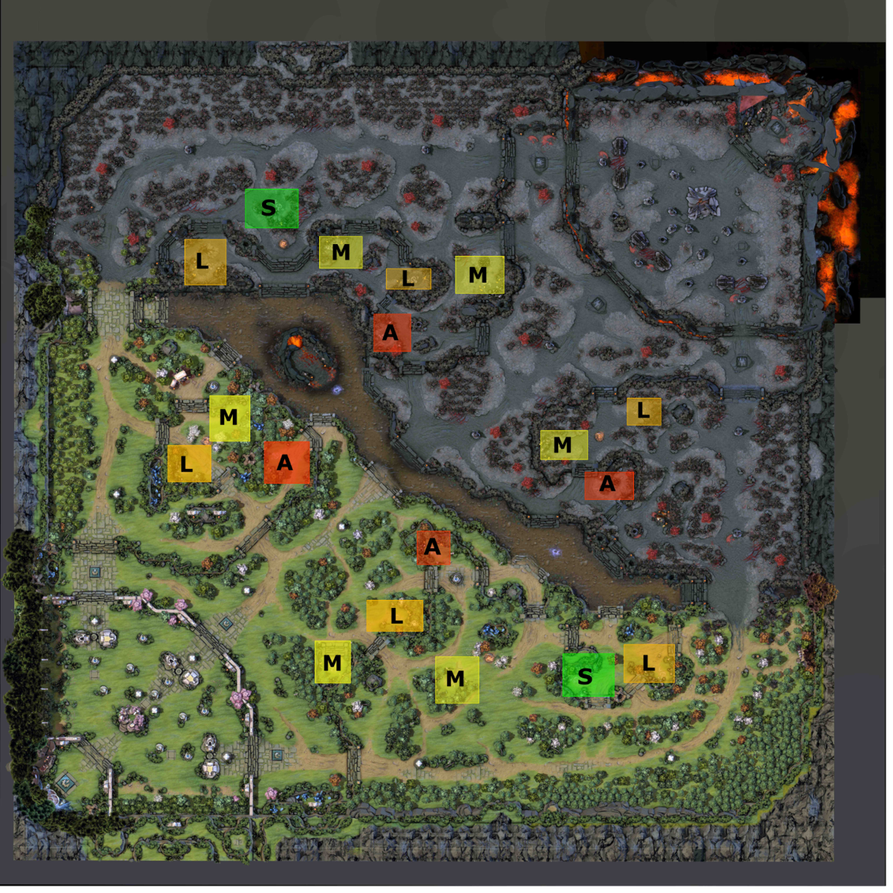
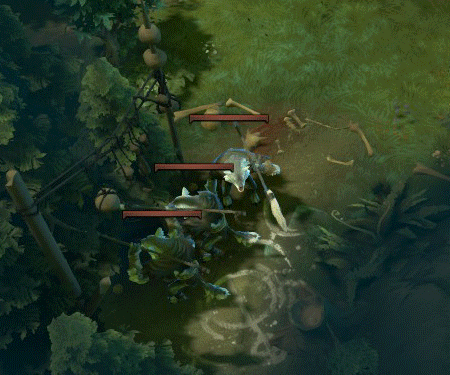
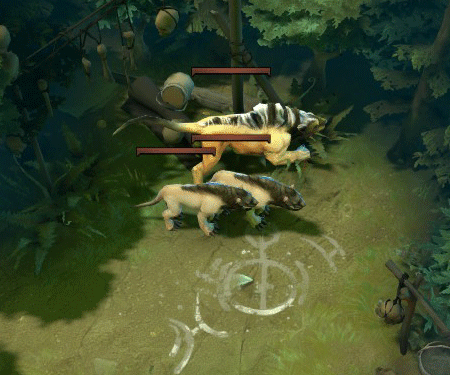
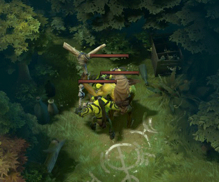
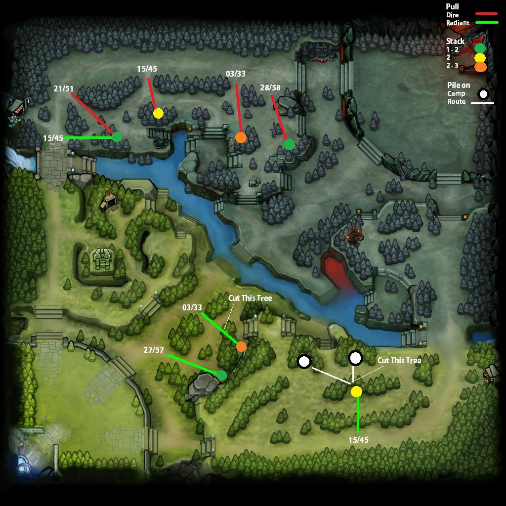

# 24. Лес

Начинающие игроки выбирают фарм в лесу в начале матча, потому что там им не будут мешать вражеские герои. Продвинутые игроки выбирают лес, чтобы их команда получала максимум золота в течении матча. Если никто из команды не пойдет фармить лес, то этот источник золота останется неиспользованным.

Независимо от причин, по которым вы выбрали лес, вам необходимы знания об его механике, чтобы фармить там эффективно. Не все герои способны хорошо с этим справиться. Некоторые делают это лучше, некоторые хуже.

Есть совсем немного героев, которые могут начать фарм сразу с 1-ого уровня. Также бывают случаи, когда лесник команде вообще не нужен.

Фарм в лесу и на линии отличается. В лесу игрок должен в одиночку сражаться с нейтральными крипами без поддержки союзных крипов. Поэтому хорошие лесники должны иметь некоторые из следующих способностей:
* Для уменьшения получаемого урона.
* Для быстрого убийства нейтральных крипов, пока они не успеют нанести большой урон.
* Для призыва других существ, которые будут получать урон вместо героя.

Правильный выбор начальных предметов также очень важен для лесника. От этого зависит, сможет ли игрок успешно фармить лес или нет.

## Особенности лагерей нейтральных крипов

 
    * S (Small) - маленькие лагеря
    * M (Medium) - средние
    * L (Large) - большие
    * A (Ancient) - древние

* В каждом лагере могут появиться разные типы крипов. Этот тип выбирается случайным образом каждый раз в момент их возрождения.

* Способности у разных типов крипов различаются.

* Маленькие лагеря.

* Средние лагеря

* Большие лагеря

## Стакинг

Нейтральные крипы возродятся только тогда, когда в области их лагеря нет других существ. Эта область известна, как область возрождения нейтрального лагеря (spawn box).

## Пуллинг

Как упоминалось раньше нейтральных крипов можно выманить на линию, чтобы их начали атаковать линейные крипы.

На следующей картинке указаны моменты времени, когда игрок должен нападать на нейтральных крипов, чтобы они встретились с линейными крипами на линии:

Следующее видео описывает продвинутые техники фарма в лесу:

