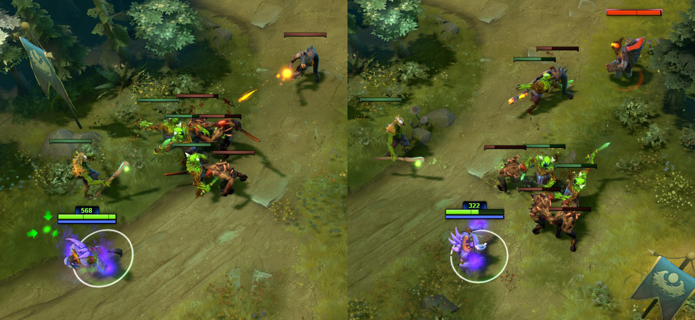
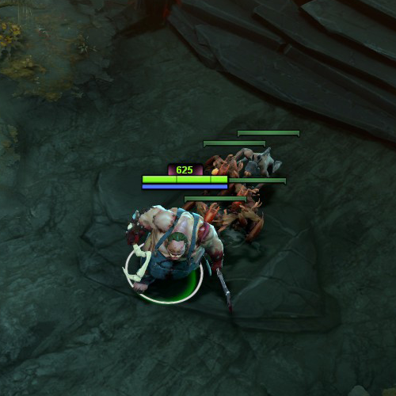
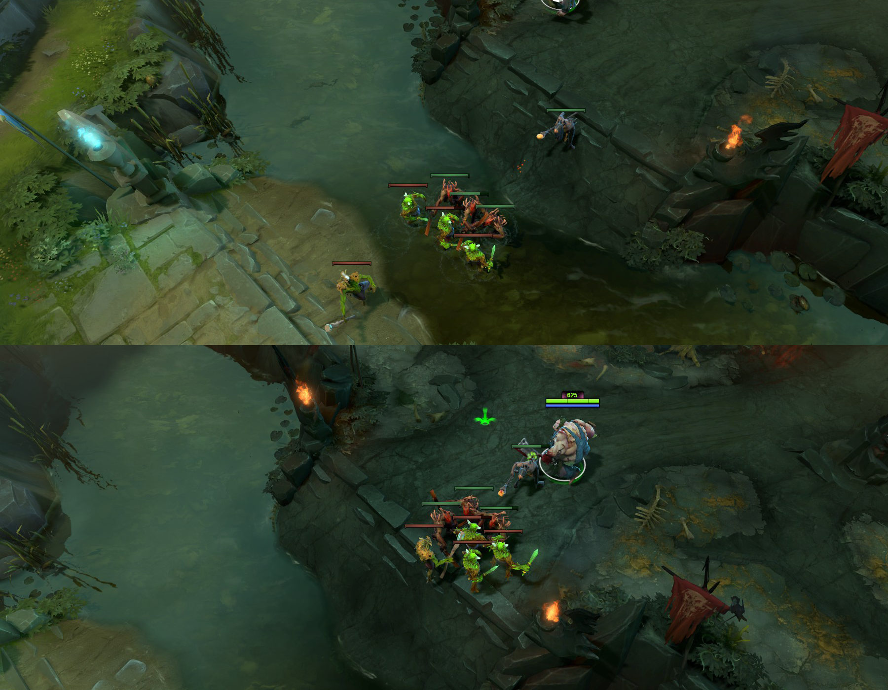

# 25. Особенности фарма на линии

## Контроль линии

Понимание того, как присутствие героя влияет на происходящее на линии, а также техник её контроля, позволит вам эффективно справляться с любой задачей: от безопасного фарма под союзной башней до пуша линии и уничтожения башни противника.

## Равновесие крипов на линии

В течении матча точка на линии, где встречаются и сражаются крипы постоянно смещается. Особенно в случаях, когда герои помогают их убивать. В течение линейной фазы матча крайне важно следить за тем, где сражаются крипы.

* Намного безопаснее наносить последний удар по крипам тогда, когда они сражаются недалеко от вашей башни. Потому что она защитит вас от ганга.

* Если вражеская команда попытается вас убить, пока вы фармите, вы можете быстро отступить под башню. В этом случае меньше вероятность, что вас продолжат преследовать.

* Если крипы сражаются далеко от вашей башни, то, нанося по ним последние удары, вы находитесь в опасной позиции.

Если ваш герой превосходит оппонента, вы можете активно пушить линию, а затем атаковать и уничтожить вражескую башню. Когда вражеская башня атакует ваших крипов, они будут убиты быстрее. Это позволит в скором времени волне вражеских крипов продвинуться обратно к вашей башне. В результате равновесие последующих волн крипов сдвинется ближе к вашей башне.

Нанесение последнего удара по вражеским крипам нарушает равновесие, потому что они умирают быстрее ваших. В большем масштабе времени это означает, что волны ваших крипов медленно приближаются к башне противника. Там наносить последний удар сложнее и опаснее. Именно поэтому важно точно рассчитывать время ваших атак по крипам и наносить им только последние удары.

Скомпенсировать эффект пуша линии из-за последнего удара можно добиванием союзных крипов. Это не означает, что вы должны ждать и наносить союзным крипам только последний удар. Вы можете атаковать их при уровне здоровья меньше половины. Этого будет достаточно, чтобы ваши крипы умирали быстрее. Убийство союзных крипов компенсирует преимущество, которое они получают за счёт ваших последних ударов по крипами противника.

Maintaining creep equilibrium through balanced last-hitting and denying results in creep waves meeting at the same place in the lane every time, wave after wave.
Сохранение равновесии на линии благодаря сбалансированным последним ударам и добиваниям приведёт к тому, что волны крипов обеих команд будут встречаться постоянно в одной и той же точке. Фарм на линии при сохранении равновесия называется **статичным фармом** (static-farming).

## Управление крипами на линии за счёт их агрессии

Техника привлечения агрессии крипов на себя будет полезна героям ближнего боя. Для этого необходимо напасть на вражеского героя (правый клик мыши по нему) и сразу же отступить под союзную башню. Вражеские крипы начнут преследовать вас до тех пор, пока снова не поменяют свой приоритет атаки и не продолжат бить других крипов. В результате ваши и вражеские крипы поменяются местами, как на картинке:

Расположение вражеских крипов с вашей стороны безопаснее для нанесения по ним последнего удара по двум причинам: они ближе к вам, союзные крипы находятся впереди и защитят вас от вражеского героя.

## Пуллинг

Пуллинг нейтральных крипов - это также тактика вывести союзных крипов с линии. Вместо того чтобы позволить им двигаться дальше по линии и в конечном счёте столкнуться с вражескими крипами, их можно увести с линии и заставить сражаться с нейтральными крипами из ближайшего лагеря в лесу.

Это позволит вражеским крипам без препятствий достичь вашей башни.

Если лагерь нейтральных крипов был стакнут, перед тем как вы вытаскиваете его на линию, нейтральные крипы могут перебить всю волну ваших крипов. Тем самым вы лишите врага золота и опыта, которые он бы получил за убийство этой волны.

Во время сражения вашей волны с нейтральными крипами, вы можете наносить по ним последний удар и добивать союзных крипов точно так же, как вы бы делали это на линии в обычных условиях.

* В большинстве случаев перед началом пуллинга вам надо стакнуть нейтральных крипов. Поэтому общим правилом будет: всегда делайте стаки перед пуллингом.

Опытные противники не дадут вам свободно пуллить нейтральных крипов безнаказанно. Они могу полностью выключть возрождение нейтральных крипов в лагере, поместив в нём вард. Также они могут попытаться вытащить ваших крипов обратно на линию или перебить их прямо в лесу вместе с нейтральными крипами.

## Блокировка крипов

Герои могут замедлить продвижение линейных крипов, вставая перед ними. Этот приём остановит волну крипов и заставит их обходить препятствие. Если герой начнёт это делать в самом начале своей линии и продолжит двигаться вместе с крипами, постоянно блокируя их, это значительно изменит точку на линии, где встретятся крипы обеих команд.

Герой блокирует крипов на средней линии:

Первая картинка, приведённая ниже, показывает точку встречи крипов, если обе волны не блокировались героями. Вторая картинка - точка встречи, когда игрок команды Сил Тьмы блокировал своих крипов. Заметьте, что крипы встретились наверху лестницы. Это даст игроку команды Сил Тьмы преимущество на возвышенности, потому что оппоненту придётся стоять на реке, чтобы наность последний удар по крипам.

Блокировка крипов обычно выполянется для самой первой волны и только на средней и тяжёлой линиях. (Силы Света - верхняя, Силы Тьмы - нижняя).
