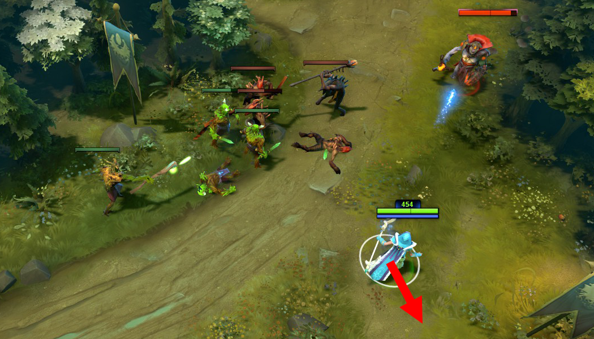
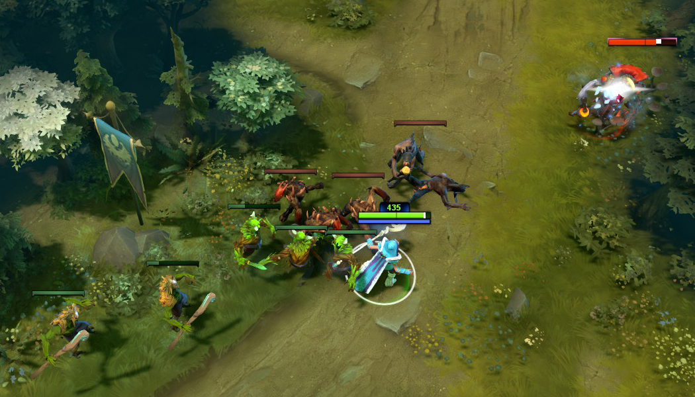

# 25. Особенности фарма на линии

## Контроль линии

Понимание того, как присутствие героя влияет на происходящее на линии, а также техник её контроля, позволит вам эффективно справляться с любой задачей: от безопасного фарма под союзной башней до пуша линии и уничтожения башни противника.

## Равновесие крипов на линии

В течение матча точка на линии, где встречаются и сражаются крипы постоянно смещается. Особенно в случаях, когда герои помогают их убивать. В течение линейной фазы матча крайне важно следить за тем, где сражаются крипы.

* Намного безопаснее наносить последний удар по крипам тогда, когда они сражаются недалеко от вашей башни. Она защити вас в случае опасности.

* Если вражеская команда попытается вас убить, пока вы фармите, можно быстро отступить под союзную башню. Это уменьшит вероятность преследования.

* Если крипы сражаются далеко от союзной башни, и вы наносите по ним последние удары - ваша позиция опасна.

В случае когда ваш герой превосходит противника по фарму, вы можете активно пушить линию, а затем атаковать и уничтожить вражескую башню. Но следует помнить: когда вражеская башня атакует союзных крипов, они умрут быстрее. Это позволит в скором времени волне вражеских крипов продвинуться обратно к вашей башне. В результате равновесие последующих волн крипов сдвинется ближе к ней.

Нанесение последнего удара по вражеским крипам нарушает равновесие, потому что они умирают быстрее ваших. В большем масштабе времени это означает, что волны ваших крипов медленно приближаются к башне противника. Там наносить последний удар сложнее и опаснее. Именно поэтому важно точно рассчитывать время ваших атак по крипам и наносить им только последние удары.

Скомпенсировать эффект пуша линии из-за последнего удара можно добиванием союзных крипов. Это не означает, что вы должны ждать и наносить союзным крипам только последний удар. Вы можете атаковать их при уровне здоровья меньше половины. Этого будет достаточно, чтобы ваши крипы умирали быстрее. Убийство союзных крипов компенсирует преимущество, которое они получают за счёт ваших последних ударов по крипами противника.

Сохранение равновесия на линии благодаря сбалансированным последним ударам и добиваниям приведёт к тому, что волны крипов обеих команд будут встречаться постоянно в одной и той же точке. Фарм на линии при сохранении равновесия называется **статичным фармом** (static-farming).

## Управление крипами на линии за счёт их агрессии

Техника привлечения агрессии крипов на себя будет полезна героям ближнего боя. Для этого необходимо напасть на вражеского героя (правый клик мыши по нему) и сразу же отступить под союзную башню. Вражеские крипы начнут преследовать вас до тех пор, пока снова не поменяют свой приоритет атаки и не продолжат бить других крипов. В результате ваши и вражеские крипы поменяются местами, как на картинке:

Расположение вражеских крипов с вашей стороны безопаснее для нанесения по ним последнего удара по двум причинам: они ближе к вам, союзные крипы находятся впереди и защитят вас от вражеского героя.

## Пуллинг

Пуллинг нейтральных крипов - это тактика отвода союзных крипов с линии. Вместо того чтобы позволить им двигаться дальше по линии и в конечном счёте столкнуться с вражескими крипами, их можно увести с линии и заставить сражаться с нейтральными крипами из ближайшего лагеря в лесу.

Это позволит вражеским крипам без препятствий достичь вашей башни.

Если лагерь нейтральных крипов был стакнут, перед тем как вы вытаскиваете его на линию, нейтральные крипы могут перебить всю волну ваших крипов. Тем самым вы лишите врага золота и опыта, которые он бы получил за убийство этой волны.

Во время сражения вашей волны с нейтральными крипами, вы можете наносить по ним последний удар и добивать союзных крипов точно так же, как вы бы делали это на линии в обычных условиях.

* В большинстве случаев перед началом пуллинга вам надо стакнуть нейтральных крипов. Поэтому общим правилом будет: всегда делайте стаки перед пуллингом.

Опытные противники не дадут вам беспрепятственно пуллить нейтральных крипов. Они могут предотвратить их возрождение, поместив в нейтральном лагере вард. Также они попытаются вытащить ваших крипов обратно на линию или перебить их прямо в лесу вместе с нейтральными крипами.

## Блокировка крипов

Герои могут замедлить продвижение линейных крипов, встав у них на пути. Этот приём остановит волну крипов и заставит их обходить препятствие. Если герой начнёт это делать в самом начале своей линии и продолжит двигаться вместе с крипами, постоянно блокируя их, это значительно изменит точку на линии, где встретятся крипы обеих команд.

Герой блокирует крипов на средней линии:

Первая картинка, приведённая ниже, показывает точку встречи крипов, если обе волны не блокировались героями. Вторая картинка - точка встречи, когда игрок команды Сил Тьмы блокировал своих крипов. Заметьте, что крипы встретились наверху лестницы. Это даст игроку команды Сил Тьмы преимущество на возвышенности, потому что оппоненту придётся стоять на реке, чтобы наносить последний удар по крипам.

Блокировка крипов обычно выполняется для самой первой волны и только на средней и тяжёлой линиях. (Силы Света - верхняя, Силы Тьмы - нижняя).

## Харас

Вы можете контролировать линию, атакуя вражеского героя, находящегося около крипов. Активный харас с вашей стороны помешает противнику приблизиться к крипам на расстояние, достаточное для последнего удара. Доминируя на линии, вы можете  заставить вражеского героя отступить на расстояние, где он не будет получать опыт за убиваемых крипов.

* Вы должны оставаться на линии, чтобы создавать угрозу героям противника и не давать им беспрепятственно наносить последние удары по крипам.

* Герои дальнего боя эффективны в харасе и, особенно, против героев ближнего боя, которые не смогут ответить на атаки.

* Харас также заставляет вражеских героев расходовать предметы для восстановления здоровья. Эффективный харас приведёт к тому, что оппонент израсходует все свои предметы для лечения и останется на линии с низким уровнем здоровья. Тогда вы сможете  легко убить его. Игроки с низким (но не критическим) уровнем здоровья, как правило, предпочтут оставаться на линии, чем идти к фонтану и лечиться. В противном случае они недополучат свой фарм золота и опыта. Это вынудит их играть пассивнее: оставаться в радиусе получения опыта за убиваемых крипов, но не приближаться к ним для нанесения последних ударов.

* Враг с низким уровнем здоровья после хараса часто будет пытаться наносить последние удары по крипам и выманивать их в более удобную для него точку.

Следующая картинка демонстрирует правильный харас. Красная стрелка показывает направление движения героя сразу после атаки противника, чтобы он и вражеские крипы не успели нанести ответный урон.

Картинка ниже демонстрирует неправильный харас. Герой находится слишком близко к вражеским крипам и в результате получит от них урон.

Вы должны выбирать такую позицию своего героя, чтобы врагу было тяжелее вас харасить. В приведённых выше примерах если бы герой Сил Тьмы находился выше и левее за союзными крипами, то у оппонента не было бы удобных позиций для хараса.

Следующее видео описывает основы пуллинга:

Видео о выборе правильной позиции для вашего героя:

Видео о продвинутых техниках пуллинга:

