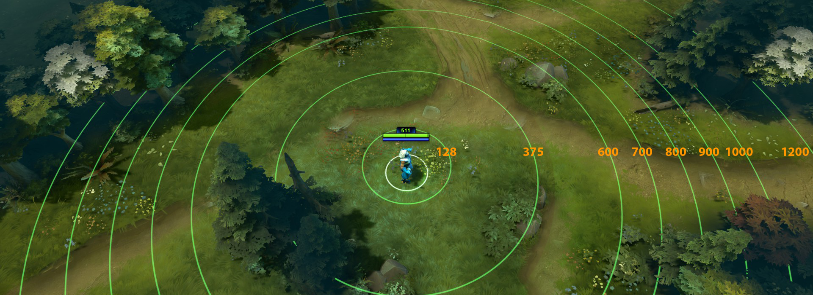
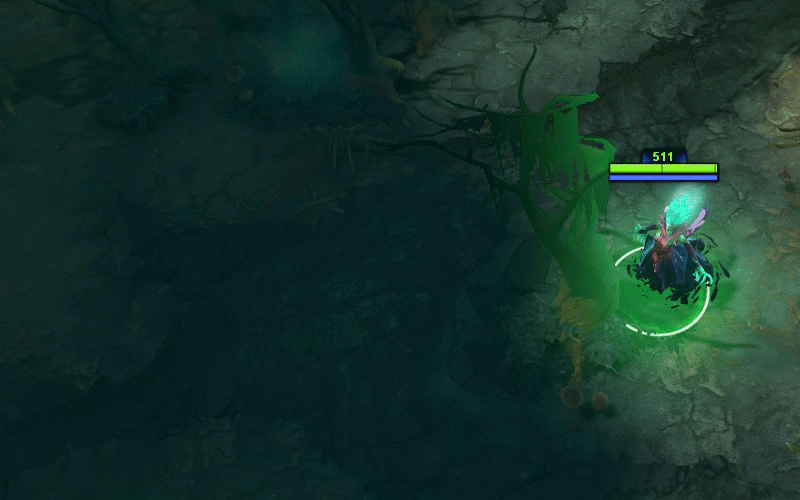

# 3. Основы и механика игры

В этом разделе описаны существа, предметы, механика игры, важные термины и понятия.

Нижеследующие термины представляют собой ссылки на Wiki странички.

[**Золото**](https://dota2-ru.gamepedia.com/%D0%97%D0%BE%D0%BB%D0%BE%D1%82%D0%BE) (Gold)

* Вы получаете 1 единицу золота каждые 0.6 секунды, что дает 5 золота каждые 3 секунды.
* Используется для покупки предметов.
* Игрок начинает матч с 625 золота.
* Вы теряете золото, когда ваш герой [умирает](https://dota2-ru.gamepedia.com/%D0%97%D0%BE%D0%BB%D0%BE%D1%82%D0%BE#.D0.92.D1.8B.D0.BA.D1.83.D0.BF).
* Убийство вражеских героев и некоторые другие действия, описанные далее, вознаграждаются золотом.

[**Предметы**](https://dota2-ru.gamepedia.com/%D0%9F%D1%80%D0%B5%D0%B4%D0%BC%D0%B5%D1%82%D1%8B) (Items) - это объекты, которые покупаются в магазине за золото. Более подробны описаны в разделе ["Предметы"]().

* Делают героев сильнее и могут иметь собственные [**способности**](https://dota2-ru.gamepedia.com/%D0%A1%D0%BF%D0%BE%D1%81%D0%BE%D0%B1%D0%BD%D0%BE%D1%81%D1%82%D0%B8) (abilities).
* Герой может носить шесть предметов в своем [**инвентаре**](https://dota2-ru.gamepedia.com/%D0%98%D0%BD%D1%82%D0%B5%D1%80%D1%84%D0%B5%D0%B9%D1%81#.D0.98.D0.BD.D0.B2.D0.B5.D0.BD.D1.82.D0.B0.D1.80.D1.8C). Кроме того, три предмета могут переноситься в ранце (рюкзаке, backpack).
* Дополнительные предметы могут храниться в [**тайнике**](https://dota2-ru.gamepedia.com/%D0%98%D0%BD%D1%82%D0%B5%D1%80%D1%84%D0%B5%D0%B9%D1%81#.D0.A2.D0.B0.D0.B9.D0.BD.D0.B8.D0.BA) (stash), который находится на базе у [**фонтана**](https://dota2-ru.gamepedia.com/%D0%A1%D1%82%D1%80%D0%BE%D0%B5%D0%BD%D0%B8%D1%8F#.D0.A4.D0.BE.D0.BD.D1.82.D0.B0.D0.BD.D1.8B). Предметы, находясь в тайнике, не влияют на героя.

**Расстояние** (Дистанция, Distance) - используется для определения дальности и радиуса. Измеряется в собственных единицах.

[**Опыт**](https://dota2-ru.gamepedia.com/%D0%9E%D0%BF%D1%8B%D1%82) (Experience) - присуждаемые герою очки, когда поблизости от него умирает вражеский крип или герой.

* Герой получает новый уровень, когда накапливает достаточно очков опыта.
* Количество опыта за убитого вражеского крипа или героя делится поровну между всеми героями вашей команды в радиусе 1300 единиц.

[**Крип**](https://dota2-ru.gamepedia.com/%D0%9A%D1%80%D0%B8%D0%BF%D1%8B) (Creep) - маленькое автономное существо, с которым могут взаимодействовать герои. Существует два типа крипов: линейные и нейтральные. Линейные крипы относятся к одной из команд, а нейтральные - нет.

* Когда крип умирает, находящиеся поблизости вражеские герои получают опыт.
* Бывают трех типов: мечники (melee), маги (ranged) и катапульты (siege).

[**Волна крипов**](https://dota2-ru.gamepedia.com/%D0%9B%D0%B8%D0%BD%D0%B5%D0%B9%D0%BD%D1%8B%D0%B5_%D0%BA%D1%80%D0%B8%D0%BF%D1%8B) (Creep Wave) - группа крипов, которая появляется каждые 30 секунд около барак в конце каждой линии и двигается в сторону базы противника.

* В каждую волну могут входить крипы трёх типов: мечники, маги и катапульты.
* Первая волна крипов состоит из 3-х мечников и 1-ого мага.
* Катапульты появляются начиная с 3-ей минуты (отметка игрового таймера 3:00).
* Катапульты появляются только в каждой седьмой волне.
* Размер волн периодически увеличивается на протяжении матча.

[**Последний удар**](https://dota2-ru.gamepedia.com/%D0%A2%D0%B5%D1%85%D0%BD%D0%B8%D0%BA%D0%B0_%D0%BA%D0%BE%D0%BD%D1%82%D1%80%D0%BE%D0%BB%D1%8F_%D0%BA%D1%80%D0%B8%D0%BF%D0%BE%D0%B2#.D0.9F.D0.BE.D1.81.D0.BB.D0.B5.D0.B4.D0.BD.D0.B8.D0.B9_.D1.83.D0.B4.D0.B0.D1.80) (Last-hit) - удар, убивающий вражеского крипа.

* Нанося последний удар по крипу, игрок получает золото.

[**Добивание**](https://dota2-ru.gamepedia.com/%D0%94%D0%BE%D0%B1%D0%B8%D0%B2%D0%B0%D0%BD%D0%B8%D0%B5) (Денай, Deny) - последний удар по союзному крипу.

* Добивание крипа уменьшает на 50% количество опыта, которое получит вражеская команда за его смерть.
* Из-за добивания вражеская команда не сможет получить золото за счёт последнего удара по крипу.
* Вы можете атаковать союзного крипа только тогда, когда уровень его здоровья опустится ниже 50%.
* Чтобы добить крипа нужно нажать клавишу атаки (по умолчанию *A*) и кликнуть левой кнопкой мыши по крипу. Также вы можете включить опцию "Принудительная атака правой кнопкой мыши" в настройках игры, чтобы добивать крипов только по клику мыши.

**Фарм** (Farming) - нанесение последнего удара по нейтральным и вражеским крипам с целью получения золота. Может происходить или на линии, или в лесу.

[**Дерево**](https://dota2-ru.gamepedia.com/%D0%94%D0%B5%D1%80%D0%B5%D0%B2%D1%8C%D1%8F) (Tree) - особая часть ландшафта карты.

* Деревья мешают [**обзору**](https://dota2-ru.gamepedia.com/%D0%9E%D0%B1%D0%B7%D0%BE%D1%80).

* Некоторые способности и предметы могут уничтожать деревья.
* На карте есть два участка с большим количеством деревьев, которые называются лесом или джунглями (jungle).
* Через 5 минут после уничтожения деревья вырастают снова.

Деревья на стороне реки Сил Света и на стороне Сил Тьмы.

[**Лагерь нейтральных крипов**](https://dota2-ru.gamepedia.com/%D0%9D%D0%B5%D0%B9%D1%82%D1%80%D0%B0%D0%BB%D1%8C%D0%BD%D1%8B%D0%B5_%D0%BA%D1%80%D0%B8%D0%BF%D1%8B) (Neutral Creep Camp) - место появления нейтральных крипов на карте.

* Лагеря расположены в лесу. Первые нейтральные крипы появляются в них через 30 секунд после первого появления крипов на линии (отметка игрового таймера 00:30).
* После этого нейтральные крипы будут появляться каждую минуту (на отметках таймера 01:00, 02:00, 03:00, и т.д.).
* Нейтральные крипы - это дополнительный источник золота и опыта.
* Подробная информация о нейтральных крипах приведена в разделах ["Продвинутая игровая механика"]() и ["Лес"]().

[**Суперкрипы**](https://dota2-ru.gamepedia.com/%D0%9B%D0%B8%D0%BD%D0%B5%D0%B9%D0%BD%D1%8B%D0%B5_%D0%BA%D1%80%D0%B8%D0%BF%D1%8B#.D0.A2.D0.B8.D0.BF.D1.8B) (Mega Creep) - усиленная версия линейных крипов.

* Суперкрипы появляются вместо обычных крипов, когда казармы (см раздел ["4. Строения"](4_buildings.md)) противника уничтожены.
* Умирая, дают вражеским героям меньше золота и опыта, чем обычные крипы.
* Когда все шесть казарм противника уничтожены, суперкрипы усиливаются до мегакрипов.
* Суперкрипы мечники и маги:

[**Урон**](https://dota2-ru.gamepedia.com/%D0%A2%D0%B8%D0%BF%D1%8B_%D1%83%D1%80%D0%BE%D0%BD%D0%B0)
Существует три типа урона, который герои могут нанести или получить. Эти типы должен знать каждый игрок.

* Физический - к этому типу, как правило, относят урон от обычных атак. Атака героя, не усиленная какими-либо способностями, является физическим уроном. Обычные атаки других существ, например крипов, также дают физический урон.
	* Существуют разные виды физического урона. Для новичка это может быть не так важно. Более продвинутые игроки могут обратиться к [Wiki странице](https://dota2-ru.gamepedia.com/%D0%A2%D0%B8%D0%BF%D1%8B_%D1%83%D1%80%D0%BE%D0%BD%D0%B0#.D0.A2.D0.B8.D0.BF.D1.8B_.D1.84.D0.B8.D0.B7.D0.B8.D1.87.D0.B5.D1.81.D0.BA.D0.BE.D0.B3.D0.BE_.D1.83.D1.80.D0.BE.D0.BD.D0.B0). Физический урон может быть уменьшен за счет [**брони**](https://dota2-ru.gamepedia.com/%D0%91%D1%80%D0%BE%D0%BD%D1%8F).
* Магический - этот тип урона обычно наносится заклинаниями. Он может быть уменьшен за счет [**сопротивления магии**](https://dota2-ru.gamepedia.com/%D0%A1%D0%BE%D0%BF%D1%80%D0%BE%D1%82%D0%B8%D0%B2%D0%BB%D0%B5%D0%BD%D0%B8%D0%B5_%D0%BC%D0%B0%D0%B3%D0%B8%D0%B8).
* Чистый - тип урона, похожий на магический. Он не может быть уменьшен сопротивлением магии или броней.

Dota 2 полна исключений. Существует много заклинаний, вещей и героев, которые не следуют этим общим правилам. Вы узнаете об этих исключениях в процессе самой игры.

[**Роли**](https://dota2-ru.gamepedia.com/%D0%A0%D0%BE%D0%BB%D0%B8) - вклад героя в игру своей команды, который определяется его [**параметрами**](https://dota2-ru.gamepedia.com/%D0%90%D1%82%D1%80%D0%B8%D0%B1%D1%83%D1%82%D1%8B) (атрибутами, attributes), способностями (abilities) и предметами.

[**Пушинг**](https://dota2-ru.gamepedia.com/%D0%9E%D1%81%D0%B0%D0%B4%D0%B0) (Pushing) - убийство волн вражеских крипов с целью дать союзным крипам свободную линию для атаки зданий противника.

* **Пушеры** (Pusher) - герои, которые хорошо справляются с этой задачей.

[**Ганк**](https://dota2-ru.gamepedia.com/%D0%93%D0%B0%D0%BD%D0%BA) - неожиданное нападение и убийство вражеского героя.

* **Ганкеры** (Gankers) - герои, которые хорошо подходят для этой задачи.
