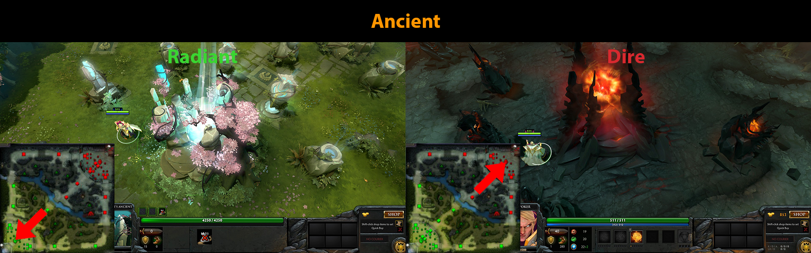
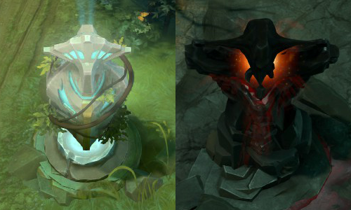
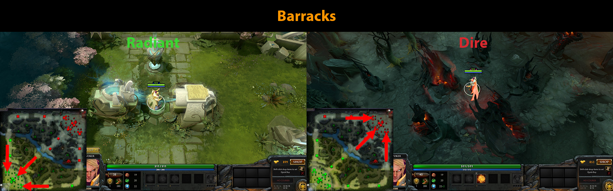
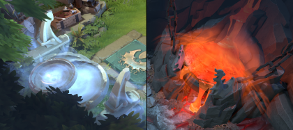
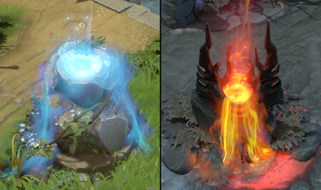

# 4. Строения

Строения расположены на базах команд Сил Света и Сил Тьмы. За уничтожение строений противника игроки получают золото.

[**Крепость**](https://dota2-ru.gamepedia.com/%D0%A1%D1%82%D1%80%D0%BE%D0%B5%D0%BD%D0%B8%D1%8F#.D0.9A.D1.80.D0.B5.D0.BF.D0.BE.D1.81.D1.82.D0.B8) (Ancient) - главное строение на базе каждой команды. В игре побеждает команда, которая первой уничтожит Крепость противника.

* Может быть атакована только после уничтожения защищающих её двух башен.
* Альтернативное название Крепости - Трон (Throne) (по терминологии Dota 1).

[**Башни**](https://dota2-ru.gamepedia.com/%D0%A1%D1%82%D1%80%D0%BE%D0%B5%D0%BD%D0%B8%D1%8F#.D0.91.D0.B0.D1.88.D0.BD.D0.B8) - строения, которые защищают линии, казармы и крепость. Они неподвижны и имеют дальний тип атаки. Башни стреляют мощными снарядами по приблизившимся к ним врагам.

* Существует 4 уровня башен. Их нумерация зависит от удаленности от союзной Крепости. Башни 1-ого уровня самые удаленные. Башни 4-ого уровня расположены около самой Крепости.
* Башни большего уровня наносят больше урона.
* Вражеская команда получает золото за уничтожение башен. Чем выше уровень башни, тем выше эта награда.
* Башни атакуют вражеских героев, которые нападают на союзных героев.
* Имеют дальность атаки (attack range) 700 единиц.
* Игрок может добить союзную башню. В этом случае команда противника получит меньше золота.
	* В отличие от правила добивания крипов, вы можете атаковать союзную башню только с уровнем здоровья меньше 10%.

Башни Сил Света и Сил Тьмы:

На [Wiki страничке](https://dota2-ru.gamepedia.com/%D0%A1%D1%82%D1%80%D0%BE%D0%B5%D0%BD%D0%B8%D1%8F#.D0.9F.D1.80.D0.B8.D0.BE.D1.80.D0.B8.D1.82.D0.B5.D1.82.D0.BD.D0.BE.D1.81.D1.82.D1.8C_.D0.B2_.D0.B2.D1.8B.D0.B1.D0.BE.D1.80.D0.B5_.D1.86.D0.B5.D0.BB.D0.B5.D0.B9) вы найдёте алгоритм, по которому башни определяют цель своей атаки.

Вы можете включить опцию "Зоны атаки башен при зажатой Alt" в настройках интерфейса игры. Теперь при нажатии клавиши *Alt* зоны атаки всех башен будут подсвечиваться.

[**Казармы**](https://dota2-ru.gamepedia.com/%D0%A1%D1%82%D1%80%D0%BE%D0%B5%D0%BD%D0%B8%D1%8F#.D0.9A.D0.B0.D0.B7.D0.B0.D1.80.D0.BC.D1.8B) - строения на концах каждой линии, около которых появляются линейные крипы.

* Казармы невозможно атаковать пока защищающая их башня не уничтожена.
* Существует два типа казарм:
	* Казармы мечников
	* Казармы магов
* Когда казармы магов уничтожены, на соответствующей линии начнут появляться вражеские суперкрипы маги (вместо обычных крипов магов).
* Когда казармы мечников уничтожены, на соответствующей линии начнут появляться вражеские суперкрипы мечники (вместо обычных крипов мечников).

[**Фонтан**](https://dota2-ru.gamepedia.com/%D0%A1%D1%82%D1%80%D0%BE%D0%B5%D0%BD%D0%B8%D1%8F#.D0.A4.D0.BE.D0.BD.D1.82.D0.B0.D0.BD.D1.8B) (Fountain) - строение, которое находится в зоне возрождения героев.

* Фонтан дает всем союзным существам в радиусе 1200 единиц ауру, ускоряющую восстановление здоровья и маны.
* Фонтан атакует всех вражеских существ в радиусе 1200 единиц.

Башни, крепость и фонтан имеют свойство [**истинное зрение**](https://dota2-ru.gamepedia.com/%D0%9D%D0%B5%D0%B2%D0%B8%D0%B4%D0%B8%D0%BC%D0%BE%D1%81%D1%82%D1%8C#True_Sight) (True Sight). Они могут обнаруживать невидимых вражеских существ.

[**Святыни**](https://dota2-ru.gamepedia.com/%D0%A1%D1%82%D1%80%D0%BE%D0%B5%D0%BD%D0%B8%D1%8F#.D0.A1.D0.B2.D1.8F.D1.82.D1.8B.D0.BD.D0.B8) (Shrine) - строения со способностью давать всем находящимся рядом союзным существам ауру восстановления здоровья и маны.

* Союзные герои, находящиеся около святыни, могут использовать её способность по нажатию правой кнопкой мыши.
* Каждая команда имеет 5 святынь - 2 из них в лесу и 3 на базе.
* К святыням можно телепортироваться.
* Действие ауры святыни длится 5 секунд и имеет радиус 500 единиц. Повторное использование ауры возможно через 5 минут.
* Святыни нельзя использовать 5 минут после появления первой волны крипов 
* Святыни не имеют радиуса обзора и свойства истинное зрение.

**Обход** (Бэкдор, Backdooring) - атака строений без поддержки союзных крипов. Башни уровней 2, 3 и 4, а также казармы имеют [**защиту от обхода**](https://dota2-ru.gamepedia.com/%D0%A1%D1%82%D1%80%D0%BE%D0%B5%D0%BD%D0%B8%D1%8F#.D0.97.D0.B0.D1.89.D0.B8.D1.82.D0.B0_.D0.BE.D1.82_.D0.BE.D0.B1.D1.85.D0.BE.D0.B4.D0.B0).

* Строения с защитой от обхода будут восстанавливать свое здоровье, если поблизости нет вражеских крипов.
* Уничтожить строение с защитой от обхода возможно. Для этого атакующая команда должна иметь высокий суммарный урон, способный снижать здоровье строения быстрее, чем оно восстанавливается.
