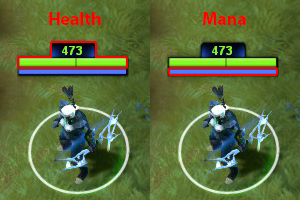
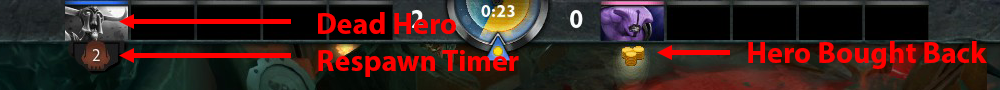

# 5. Герой

На данный момент в Dota 2 есть 113 различных [**героев**](https://dota2-ru.gamepedia.com/%D0%93%D0%B5%D1%80%D0%BE%D0%B8).

* Герои получают очки опыта и золото за убийство вражеских героев и крипов.
* Герои начинают игру с уровнем 1 и могут достичь максимального уровня 25.
* Герой получает новый уровень, когда накапливает [достаточно очков опыта](https://dota2-ru.gamepedia.com/%D0%9E%D0%BF%D1%8B%D1%82#.D0.9F.D0.BE.D0.B2.D1.8B.D1.88.D0.B5.D0.BD.D0.B8.D0.B5_.D1.83.D1.80.D0.BE.D0.B2.D0.BD.D1.8F)
* У героев отличается [дальность атаки](https://dota2-ru.gamepedia.com/%D0%94%D0%B0%D0%BB%D1%8C%D0%BD%D0%BE%D1%81%D1%82%D1%8C_%D0%B0%D1%82%D0%B0%D0%BA%D0%B8) - расстояние, на котором герои могут использовать свою обычную атаку.
	* [Герои ближнего боя](https://dota2-ru.gamepedia.com/%D0%9A%D0%B0%D1%82%D0%B5%D0%B3%D0%BE%D1%80%D0%B8%D1%8F:%D0%93%D0%B5%D1%80%D0%BE%D0%B8_%D0%B1%D0%BB%D0%B8%D0%B6%D0%BD%D0%B5%D0%B3%D0%BE_%D0%B1%D0%BE%D1%8F) должны находиться рядом со своей целью, чтобы атаковать её. У большинства таких героев дальность атаки составляет 128 единиц.
	* [Герои дальнего боя](https://dota2-ru.gamepedia.com/%D0%9A%D0%B0%D1%82%D0%B5%D0%B3%D0%BE%D1%80%D0%B8%D1%8F:%D0%93%D0%B5%D1%80%D0%BE%D0%B8_%D0%B4%D0%B0%D0%BB%D1%8C%D0%BD%D0%B5%D0%B3%D0%BE_%D0%B1%D0%BE%D1%8F) 
стреляют снарядами и в момент атаки могут находиться значительно дальше от своей цели. У разных героев дальность атаки отличается. Максимальная дальность составляет 700 единиц.

[**Здоровье**](https://dota2-ru.gamepedia.com/%D0%97%D0%B4%D0%BE%D1%80%D0%BE%D0%B2%D1%8C%D0%B5) (Health) - также известно как единицы здоровья (health points, HP). Представляет собой жизненную силу героя.

[**Мана**](https://dota2-ru.gamepedia.com/%D0%9C%D0%B0%D0%BD%D0%B0) (Mana) - ресурс, который потребляется героем для применения способностей. Для применения способности герой должен иметь достаточное количество маны.

**Смерть** (Death)

* Герой умирает, когда его уровень здоровья опускается до 0.
* Герой возрождается около фонтана после фиксированного [времени](https://dota2-ru.gamepedia.com/%D0%97%D0%BE%D0%BB%D0%BE%D1%82%D0%BE#.D0.92.D1.80.D0.B5.D0.BC.D1.8F_.D0.B2.D0.BE.D0.B7.D1.80.D0.BE.D0.B6.D0.B4.D0.B5.D0.BD.D0.B8.D1.8F), зависящего от его уровня.
* Вы можете заплатить [**выкуп**](https://dota2-ru.gamepedia.com/%D0%97%D0%BE%D0%BB%D0%BE%D1%82%D0%BE#.D0.92.D1.8B.D0.BA.D1.83.D0.BF) и сразу же возродить своего героя. Следующий выкуп будет возможен только через 7 минут.

## Параметры героя

Все герои имеют три параметра (attributes):

*  [**Сила**](https://dota2-ru.gamepedia.com/%D0%A1%D0%B8%D0%BB%D0%B0) (Strength, Str) - определяет максимальный уровень здоровья и скорость его регенерации.
*  [**Ловкость**](https://dota2-ru.gamepedia.com/%D0%9B%D0%BE%D0%B2%D0%BA%D0%BE%D1%81%D1%82%D1%8C) (Agility, Agi) - определяет броню и скорость атаки героя.
*  [**Интеллект**](https://dota2-ru.gamepedia.com/%D0%98%D0%BD%D1%82%D0%B5%D0%BB%D0%BB%D0%B5%D0%BA%D1%82) (Intelligence, Int) - определяет максимальный уровень маны и скорость её регенерации.

У каждого героя один из трех параметров является основным.  Он определяет урон, наносимый обычной атакой. Каждое очко этого параметра добавляет одно очко к урону.

С увеличением уровня все параметры героя увеличиваются автоматически. Скорость роста параметров индивидуальна для каждого героя. Как правило, основной параметр героя растёт быстрее остальных.

* Например, герой [**Lich**](https://dota2-ru.gamepedia.com/Lich) начинает игру с 18 очками силы, 15 ловкости и 18 интеллекта. Его основной параметр - интеллект. При каждом повышении уровня герой получает 1.85 очков силы, 2 ловкости и 3.25 интеллекта.

Вы можете найти больше информации о параметрах героев на [Wiki странице](https://dota2-ru.gamepedia.com/Атрибуты).

## Способности героя

У каждого герой есть уникальный набор [**способностей**](https://dota2-ru.gamepedia.com/%D0%A1%D0%BF%D0%BE%D1%81%D0%BE%D0%B1%D0%BD%D0%BE%D1%81%D1%82%D0%B8) (abilities). В общем случае у каждой способности есть  стоимость маны (mana cost) (количество маны, потребляемое за её использование). Повторное использование способности возможно только после определенного времени, называемого  **перезарядкой** (cooldown). Способности по своему воздействию могут варьироваться от самых примитивных до очень мощных.

Каждый герой обладает одной самой мощной [особой способностью](https://dota2-ru.gamepedia.com/%D0%A1%D0%BF%D0%BE%D1%81%D0%BE%D0%B1%D0%BD%D0%BE%D1%81%D1%82%D0%B8#.D0.9E.D1.81.D0.BE.D0.B1.D1.8B.D0.B5_.D1.81.D0.BF.D0.BE.D1.81.D0.BE.D0.B1.D0.BD.D0.BE.D1.81.D1.82.D0.B8) (ульта, ultimate ability). Применение этой способности может изменить ход всего матча. Часто особая способность имеет долгое время перезарядки и поэтому применятся редко.

Все герои имеют четыре основные способности (включая особую). При этом у некоторых героев есть дополнительные способности.

* Наиболее ярким примером дополнительных способностей является герой [**Invoker**](https://dota2-ru.gamepedia.com/Invoker). У него есть 10 дополнительных способностей, которые получаются в результате комбинирования четырёх основных.

Виды способностей и их воздействие более подробно рассматриваются в разделе ["7. Способности"](7_abilities.md).
