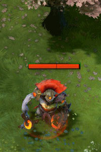
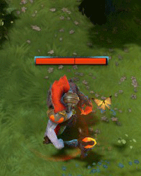
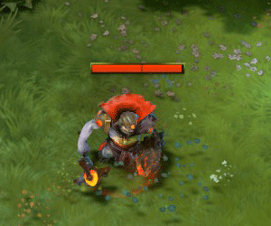
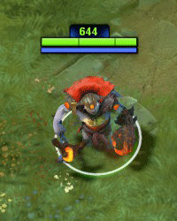
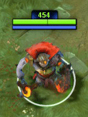
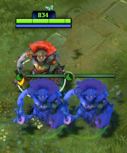
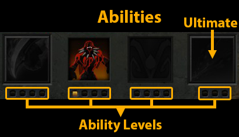

# 7. Способности

Способности (abilities) также часто называют умениями (skills) или заклинаниями (spells).

## Характеристики

Все герои имеют способности, но что это такое, и что они делают?

Ниже приведены некоторые общие характеристики способностей:

* Тип (Type) - некоторые способности должны активироваться, другие являются пассивными. Игрок должен дать команду своему герою, чтобы использовать активную способность. Пассивные способности оказывают свое воздействие постоянно.
* Тип прицеливания (Targeting type) - некоторые способности могут быть использованы только на существо, другие на указанную область. Так же есть способности, которым не требуется цель. Они немедленно воздействуют на вашего героя.
* Дальность (Range) - как близко к цели должен находится герой, чтобы использовать способность.
* Целевые существа (Target Units) - на какие существа воздействует способность? Герои или крипы, вражеские существа или союзные. Некоторые способности воздействуют только на вашего героя.
* Время применения (Cast Animation) - время между активацией способности и её воздействием. Если у способности большое время применения, противник может среагировать на её анимацию и увернуться.
* Область воздействия (Effect Radius) - радиус области, на которую воздействует способность.
* Прерываемость (Channeling) - для использования прерываемой способности герою требуется время на подготовку. Герой должен остановиться на несколько секунд и не совершать никаких действий. Некоторые способности начинают воздействовать сразу после их применения, другие только после времени подготовки. Противник может прервать такие способности, прекращая их воздействие или полностью отменяя его.

## Воздействие

Способности отличаются по своему воздействию. Ниже приведены самые распространенные варианты:

* [**Обезвреживание**](https://dota2-ru.gamepedia.com/%D0%9E%D0%B1%D0%B5%D0%B7%D0%B2%D1%80%D0%B5%D0%B6%D0%B8%D0%B2%D0%B0%D0%BD%D0%B8%D0%B5) (Дизэйблы, Disable) - мешает целевому существу использовать способности, предметы, перемещаться или атаковать.
	* [**Оглушение**](https://dota2-ru.gamepedia.com/%D0%9E%D0%B3%D0%BB%D1%83%D1%88%D0%B5%D0%BD%D0%B8%D0%B5) (Stun) - цель не может двигаться и использовать любые способности или предметы.
		* Если в команде есть несколько героев со способностями оглушения (или другим типом обезвреживания), эти способности должны использоваться друг за другом, а не одновременно. Как только действие одного оглушения закончилось, необходимо использовать следующее. Эта техника называется цепочка оглушений (chain stunning). Благодаря ей, вражеские герои будут нейтрализованы максимальный период времени. 

	* [**Безмолвие**](https://dota2-ru.gamepedia.com/%D0%91%D0%B5%D0%B7%D0%BC%D0%BE%D0%BB%D0%B2%D0%B8%D0%B5) (Silence) - цель не может использовать свои способности. При этом возможно использование предметов, перемещение и атака. Как правило, безмолвие длится намного дольше чем оглушение. 

	* [**Замедление**](https://dota2-ru.gamepedia.com/%D0%97%D0%B0%D0%BC%D0%B5%D0%B4%D0%BB%D0%B5%D0%BD%D0%B8%D0%B5) (Slow) - снижает у цели скорость передвижения или атаки.
	* [**Проклятие**](https://dota2-ru.gamepedia.com/%D0%9F%D1%80%D0%BE%D0%BA%D0%BB%D1%8F%D1%82%D0%B8%D0%B5) (Hex) - на короткое время превращает цель в маленькое безобидное существо. В этом состоянии скорость её передвижения уменьшена, а также ей нельзя использовать способности и предметы. 

* **Бафф** (Buff) - положительно влияет на параметры цели.
* **Дебафф** (Debuff) - отрицательно влияет на параметры цели.
* [**Аура**](https://dota2-ru.gamepedia.com/%D0%90%D1%83%D1%80%D0%B0) (Aura) - бафф или дебафф, воздействующий на область.
* [**Телепортация**](https://dota2-ru.gamepedia.com/%D0%A2%D0%B5%D0%BB%D0%B5%D0%BF%D0%BE%D1%80%D1%82%D0%B0%D1%86%D0%B8%D1%8F) (Телепорт, Teleport) - перемещает цель в выбранную точку на карте.
	* **Блинк** (Blink) - вид телепортации на небольшое расстояние.
* [**Иммунитет к магии**](https://dota2-ru.gamepedia.com/%D0%98%D0%BC%D0%BC%D1%83%D0%BD%D0%B8%D1%82%D0%B5%D1%82_%D0%BA_%D0%B7%D0%B0%D0%BA%D0%BB%D0%B8%D0%BD%D0%B0%D0%BD%D0%B8%D1%8F%D0%BC) (Magic Immunity) - цель под этим воздействием невосприимчива к большинству заклинаний и предметов. Подробное описание взаимодействия иммунитета к магии и различных способностей описано на Wiki странице. 

* [**Невидимость**](https://dota2-ru.gamepedia.com/%D0%9D%D0%B5%D0%B2%D0%B8%D0%B4%D0%B8%D0%BC%D0%BE%D1%81%D1%82%D1%8C) (Invisibility) - цель под этим воздействием невидима для врагов (в том числе и на миникарте) до тех пор, пока не будет раскрыта каким-либо обнаруживающим предметом или не закончится срок действия способности. 

* [**Иллюзии**](https://dota2-ru.gamepedia.com/%D0%98%D0%BB%D0%BB%D1%8E%D0%B7%D0%B8%D0%B8) - физические копии героя, которыми может управлять игрок. Для врагов иллюзии выглядят так же, как и создавший их герой. Для союзников они отмечены другим цветом. Обычно, иллюзии получают больше и наносят меньше урона, чем их хозяин. 

* [**Вампиризм**](https://dota2-ru.gamepedia.com/%D0%92%D0%B0%D0%BC%D0%BF%D0%B8%D1%80%D0%B8%D0%B7%D0%BC) (Lifesteal) - превращает часть нанесенного урона в здоровье героя при атаке вражеских существ.
* [**Истинное зрение**](https://dota2-ru.gamepedia.com/%D0%9D%D0%B5%D0%B2%D0%B8%D0%B4%D0%B8%D0%BC%D0%BE%D1%81%D1%82%D1%8C#True_Sight) (True Sight) - обнаруживает невидимых врагов в радиусе действия.
* [**Периодический урон**](https://dota2-ru.gamepedia.com/%D0%9F%D0%B5%D1%80%D0%B8%D0%BE%D0%B4%D0%B8%D1%87%D0%B5%D1%81%D0%BA%D0%B8%D0%B9_%D1%83%D1%80%D0%BE%D0%BD) (Damage Over Time, DOT) - наносит урон в течении некоторого периода времени.
	* Герой под воздействием периодического урона может быть добит союзником так же, как крип.
	* Добивание союзного героя не дает врагам получить опыт и золото за его смерть. Но убитый герой всё равно теряет золото.

* [**Модификаторы атаки**](https://dota2-ru.gamepedia.com/%D0%9C%D0%BE%D0%B4%D0%B8%D1%84%D0%B8%D0%BA%D0%B0%D1%82%D0%BE%D1%80%D1%8B_%D0%B0%D1%82%D0%B0%D0%BA%D0%B8) (Attack modifier) - изменяют обычную атаку героя, добавляя ей определенное воздействие. Примеры таких воздействий: вероятность замедления, вампиризма, сжигания маны при каждому ударе, нанесенном по врагу.
Модификаторы атаки сочетаются друг с другом, давая суммарный эффект. Но существуют также [**уникальные модификаторы атаки**](https://dota2-ru.gamepedia.com/%D0%A3%D0%BD%D0%B8%D0%BA%D0%B0%D0%BB%D1%8C%D0%BD%D1%8B%D0%B9_%D0%BC%D0%BE%D0%B4%D0%B8%D1%84%D0%B8%D0%BA%D0%B0%D1%82%D0%BE%D1%80_%D0%B0%D1%82%D0%B0%D0%BA%D0%B8) (орб эффекты), которые друг с другом не сочетаются.

Вы можете найти детальное описание способностей и их примеры на [Wiki странице](https://dota2-ru.gamepedia.com/%D0%A1%D0%BF%D0%BE%D1%81%D0%BE%D0%B1%D0%BD%D0%BE%D1%81%D1%82%D0%B8).

## Очки способностей

Вы зарабатываете одно очко способностей (skill points) при каждом повышении уровня героя. Это очко можно использовать для улучшения одной из способностей.

Уровень способности - это количество очков, которые вы в неё вложили. Этот уровень в общем случае ограничен. Для особой способности (ульты) это уровень 3, а для всех остальных - уровень 4.

Уровень героя определяет, сколько очков вы можете вложить в способность. Вкладывать очки в особую способность можно только на уровнях героя 6, 11 и 16. Остальные способности можно улучшать каждые 2 уровня героя:

| Максимальный уровень способности | Уровень героя |
| -- | -- |
| 1 | 1 |
| 2 | 3 |
| 3 | 5 |
| 4 | 7 |

Таким образом, вы можете вложить 2 очка в способность на 3-ем уровне героя, 3 очка на 5-ом и 4 на 7-ом.

Эти ограничения нужны для баланса. Они не дают игрокам вложить первые несколько очков в одну способность и сделать их героя слишком сильным для их низкого уровня.

У всех героев есть особенный вид способностей - таланты.

[**Таланты**](https://dota2-ru.gamepedia.com/%D0%A2%D0%B0%D0%BB%D0%B0%D0%BD%D1%82%D1%8B) (Talents) - это уникальные для каждого героя бонусы. Каждые 5 уровней, начиная с 10, можно выбирать один бонус из двух предложенных. Ими могут быть: увеличение атрибутов героя, дополнительное золото или опыт в секунду, а также усиление способностей. Бонус, противоположный выбранному, становится недоступным до конца матча.

Ниже приведена панель героя с 4-мя способностями. Иконка особой способности всегда расположена справа. Под каждой иконкой находится ряд маленьких квадратов. Он указывает, сколько очков было вложено в эту способность.

В этом примере только одно очко было вложено во вторую способность. Это означает, что в данный момент герой может использовать только её.
