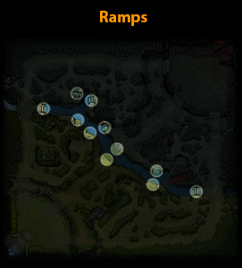

# 8. Карта

Есть несколько областей на карте, которые вы должны хорошо знать прежде, чем начать играть.

На карте есть два леса (jungle) - со стороны Сил Света и Сил Тьмы. Они находятся между линиями и рекой. Большинство лагерей нейтральных крипов находятся в этих лесах.

Река разделяет карту на стороны Сил Света и Сил Тьмы. Реку можно пересечь, но зайти в неё можно только по скатам (ramps).

