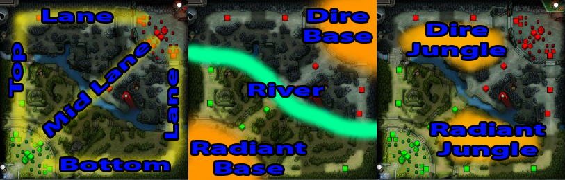
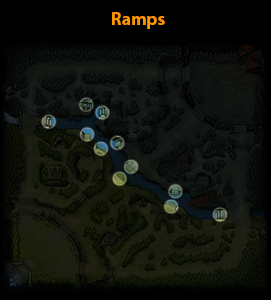
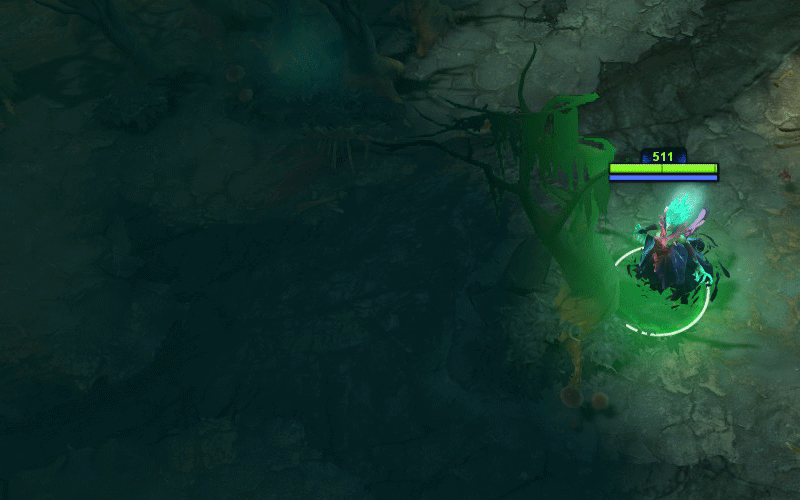
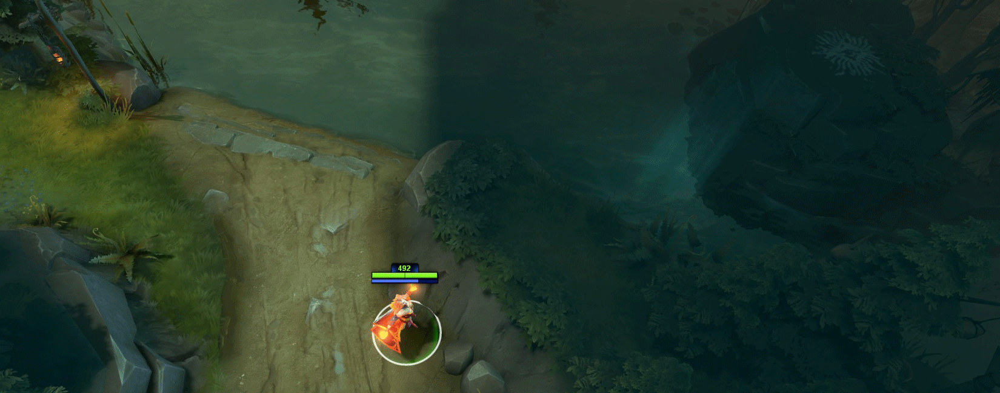
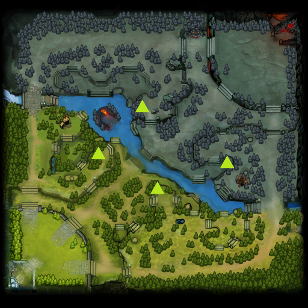
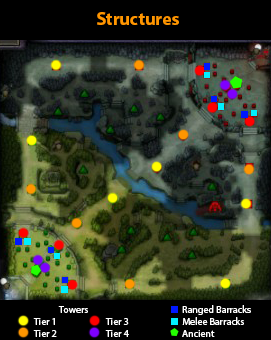
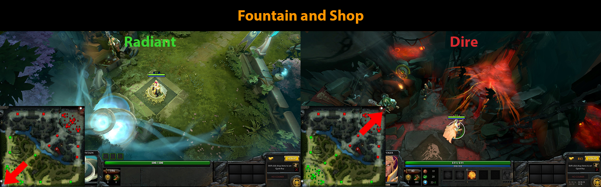
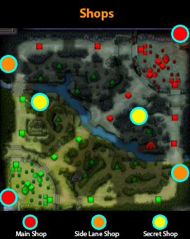
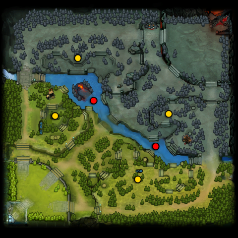
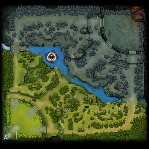

# 8. Карта

Есть несколько областей на карте, которые вы должны хорошо знать прежде, чем начать играть.

На карте есть два леса (jungle) - со стороны Сил Света и Сил Тьмы. Они находятся между линиями и рекой. Большинство лагерей нейтральных крипов находятся в этих лесах.

Река разделяет карту на стороны Сил Света и Сил Тьмы. Реку можно пересечь, но зайти в неё можно только по скатам (ramps).

[**Обзор**](https://dota2-ru.gamepedia.com/%D0%9E%D0%B1%D0%B7%D0%BE%D1%80) (Vision) - области карты, которые видимы для героя.
* Области, которые герой не видит, скрыты [**туманом войны**](https://dota2-ru.gamepedia.com/%D0%9E%D0%B1%D0%B7%D0%BE%D1%80#.D0.A2.D1.83.D0.BC.D0.B0.D0.BD_.D0.B2.D0.BE.D0.B9.D0.BD.D1.8B).
* Каждый герой видит некоторую область вокруг себя.
* Все существа и строения вашей команды имеют общий обзор. Это значит, что если одно существо видит некоторую область, все игроки этой команды её также видят.
* Деревья мешают обзору. 

* Некоторые области карты находятся на [**возвышенности**](https://dota2-ru.gamepedia.com/%D0%9E%D0%B1%D0%B7%D0%BE%D1%80#.D0.92.D0.BE.D0.B7.D0.B2.D1.8B.D1.88.D0.B5.D0.BD.D0.BD.D0.BE.D1.81.D1.82.D1.8C). Это так же влияет на обзор.

Обзор героя внизу ската, наверху и на утёсе (cliff):

[**Лагеря древних крипов**](https://dota2-ru.gamepedia.com/%D0%9D%D0%B5%D0%B9%D1%82%D1%80%D0%B0%D0%BB%D1%8C%D0%BD%D1%8B%D0%B5_%D0%BA%D1%80%D0%B8%D0%BF%D1%8B#.D0.94.D1.80.D0.B5.D0.B2.D0.BD.D0.B8.D0.B5_.D0.BB.D0.B0.D0.B3.D0.B5.D1.80.D1.8F) - четыре лагеря с очень сильными крипами.

* Древние крипы значительно сильнее обычных нейтральных крипов.
* Их убийство даёт больше золота и опыта, чем за обычных крипов.
* Имеют иммунитет ко  многим заклинаниям (например получения контроля над существом).
* Как и все остальные лагеря крипов в лесу могут [**нагромождаться**](https://dota2-ru.gamepedia.com/Creep_Stacking) (стакаться, stacked).

Месторасположение всех башен, казарм и крепостей на карте:

Месторасположение фонтанов и магазинов на базах обеих команд:

[**Лавка**](https://dota2-ru.gamepedia.com/%D0%9F%D1%80%D0%B5%D0%B4%D0%BC%D0%B5%D1%82%D1%8B#.D0.9B.D0.B0.D0.B2.D0.BA.D0.B8) (Shop) - место, где игрок может купить предметы для героя. Всего на карте есть три типа лавок:
* [**Основная лавка**](https://dota2-ru.gamepedia.com/%D0%9E%D1%81%D0%BD%D0%BE%D0%B2%D0%BD%D0%B0%D1%8F_%D0%BB%D0%B0%D0%B2%D0%BA%D0%B0) (Base Shop) - находится на базе команды около фонтана.
* [**Боковые лавки**](https://dota2-ru.gamepedia.com/%D0%91%D0%BE%D0%BA%D0%BE%D0%B2%D1%8B%D0%B5_%D0%BB%D0%B0%D0%B2%D0%BA%D0%B8) (Side Lane Shop) - предлагают меньший ассортимент товаров, чем основная лавка. Расположены на верхней и нижней линиях.
* [**Потайная лавка**](https://dota2-ru.gamepedia.com/%D0%9F%D0%BE%D1%82%D0%B0%D0%B9%D0%BD%D0%B0%D1%8F_%D0%BB%D0%B0%D0%B2%D0%BA%D0%B0) (Secret Shop)
    * Предлагает самые дорогие предметы в игре, большинство из которых не доступно в других лавках.
    * Предметы из потайной лавки, как правило, являются составными частями более мощных предметов.

[**Руны**](https://dota2-ru.gamepedia.com/%D0%A0%D1%83%D0%BD%D1%8B) (Runes) - появляются в шести специальных местах на карте. Более подробно описаны в разделе ["11. Руны"](11_runes.md).

Места появления рун на карте:

[**Рошан**](https://dota2-ru.gamepedia.com/%D0%A0%D0%BE%D1%88%D0%B0%D0%BD) (Roshan) - самый сильный нейтральный крип на карте.
* Находится в месте, известном как Логово Рошана (Roshan Pit) или просто Логово (Pit).
* Возрождается в случайный момент времени через 8-11 минут после своей смерти.
* Из убитого Рошана падает предмет  [**Aegis of the Immortal**](https://dota2-ru.gamepedia.com/Aegis_of_the_Immortal).
* Если герой, имеющий Aegis в своём инвентаре, умирает, Aegis расходуется, и герой возрождается после 5 секундной задержки с полными уровнями здоровья и маны на месте своей смерти.
* Если Aegis не был использован в течении 5 минут с момента его поднятия героем, предмет исчезает, а герой полностью восстанавливает своё здоровье в течении 5 секунд. Процесс восстановления прерывается при получении урона от других игроков или строений.
* После второй смерти и каждой последующей из Рошана падает дополнительный предмет  [**Cheese**](https://dota2-ru.gamepedia.com/Cheese). При использовании Cheese мгновенно восстанавливает 2500 здоровья и 1000 маны.
* В отличие от Aegis, Cheese можно передавать союзникам и срок его ношения не ограничен.

Месторасположение Логова Рошана на карте:

