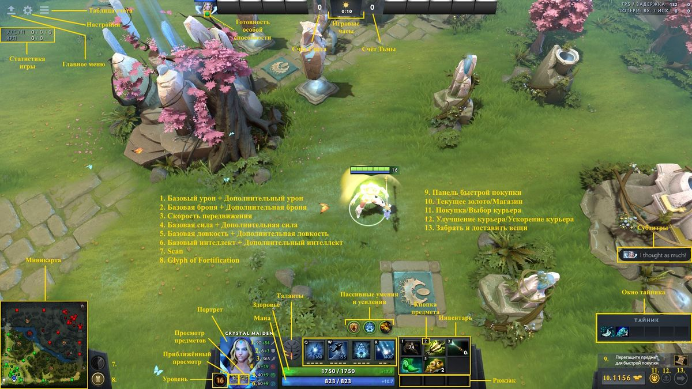
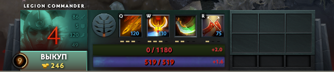

# 9. Интерфейс

[**Интерфейс**](https://dota2-ru.gamepedia.com/%D0%98%D0%BD%D1%82%D0%B5%D1%80%D1%84%D0%B5%D0%B9%D1%81) (Head-up display, HUD) - это набор внутриигровых панелей, на которых отображается важная информация о герое и текущем матче.

## Элементы интерфейса

* [**Список героев**](https://dota2-ru.gamepedia.com/%D0%98%D0%BD%D1%82%D0%B5%D1%80%D1%84%D0%B5%D0%B9%D1%81#.D0.A1.D0.BF.D0.B8.D1.81.D0.BE.D0.BA_.D0.B3.D0.B5.D1.80.D0.BE.D0.B5.D0.B2) (Hero List) - в верхней части экрана расположены портреты всех героев, участвующих в матче. Если герой убит или отключился от игры (disconnected), его портрет меняется. Время до возрождения героя отображается здесь же.
* [**Игровые часы**](https://dota2-ru.gamepedia.com/%D0%98%D0%BD%D1%82%D0%B5%D1%80%D1%84%D0%B5%D0%B9%D1%81#.D0.98.D0.B3.D1.80.D0.BE.D0.B2.D1.8B.D0.B5_.D1.87.D0.B0.D1.81.D1.8B) (Game Clock) - указывают время, прошедшее с момента начала матча. Также на них отображается текущее игровое время суток (ночь или день).
* [**Мини-карта**](https://dota2-ru.gamepedia.com/%D0%9C%D0%B8%D0%BD%D0%B8-%D0%BA%D0%B0%D1%80%D1%82%D0%B0) (Minimap) - уменьшенная версия игровой карты. На ней отображаются области, существа и строения, видимые для вашей команды.
    * Нажатие левой кнопки мыши по мини-карте переместит камеру в указанную точку.
* **Шкала опыта** (Experience Bar) - кружок вокруг уровня героя. Шкала отображает количество полученного героем опыта. Когда шкала становится полной, герой получает новый уровень.
* **Параметры героя** (Attributes) - находятся около портрета героя. В отображаемый список параметров входят: сила, ловкость, интеллект, урон, броня и скорость передвижения.
* **Панель способностей** (Abilities) - находится справа от портрета героя. Отображает, какие способности доступны в данный момент и сколько очков вложено в каждую из них. Вы можете использовать способность, нажав на иконку в этой панели или нажав горячую клавишу (hotkey).
    * При наведении курсора мыши на иконку способности отображается её подробное описание.
    * Также при наведении мыши зелёным кругом подсвечивается дальность применения этой способности.
* **КРП** (крипы, Creep Score, CS) - два счётчика в левом верхнем углу экрана. Они соответствуют числу ваших последних ударов по крипам и числу добиваний.
* **У/С/П** (Убийства/Смерти/Помощи, Kills/Deaths/Assists, K/D/A) - ваш счётчик убийств и помощи в убийстве вражеских героев. Третье число - количество ваших смертей.
* **Инвентарь** (Inventory) и **ранец** (backpack) - слоты для девяти предметов, которые герой может носить с собой. Шесть предметов в инвентаре можно использовать по нажатию мыши или горячей клавиши.
* **Быстрая покупка** (Quickbuy) - в эту панель можно добавить предметы из окна лавки, которые вы планируете приобрести. Теперь их покупка совершается по горячей клавише, не открывая окна лавки.
* [**Сканирование территории**](https://dota2-ru.gamepedia.com/%D0%A1%D0%BA%D0%B0%D0%BD%D0%B8%D1%80%D0%BE%D0%B2%D0%B0%D0%BD%D0%B8%D0%B5_%D1%82%D0%B5%D1%80%D1%80%D0%B8%D1%82%D0%BE%D1%80%D0%B8%D0%B8) (Scan) - кнопка справа от мини-карты. По её нажатию в течение 8 секунд указанная область карты сканируется. Если в этой области находятся вражеские герои, то зелёный индикатор на мини-карте станет красным.
* [**Укрепление строений**](https://dota2-ru.gamepedia.com/%D0%A1%D1%82%D1%80%D0%BE%D0%B5%D0%BD%D0%B8%D1%8F#.D0.A3.D0.BA.D1.80.D0.B5.D0.BF.D0.BB.D0.B5.D0.BD.D0.B8.D0.B5_.D1.81.D1.82.D1.80.D0.BE.D0.B5.D0.BD.D0.B8.D0.B9) (Glyph of Fortification, Glyph) - кнопка справа от мини-карты, которая активирует соответствующую способность.
    * Все строения вашей команды становятся неуязвимыми на 5 секунд.
    * Любой игрок команды может активировать эту способность.
    * Время перезарядки способности - 5 минут.

Эффекты от вещей и способностей, воздействующие на вашего героя, отображаются над панелью способностей в виде круглых иконок. Зелёная рамка вокруг каждой из них указывает, как долго будет длиться соответсвующий эффект.

## Выкуп

Кнопка для оплаты выкупа находится около портрета героя:

